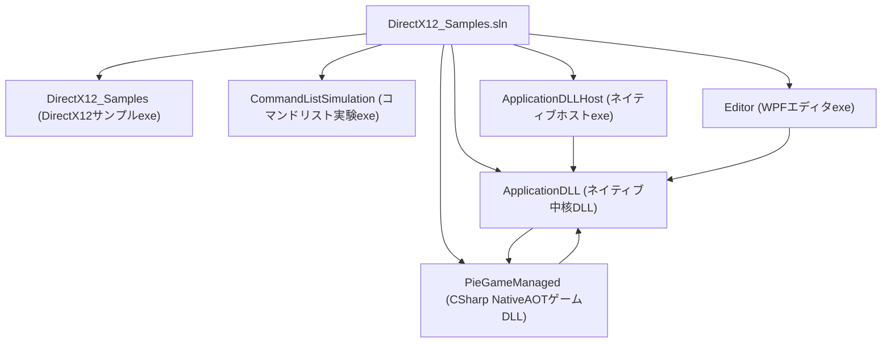
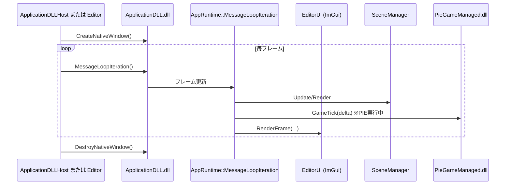
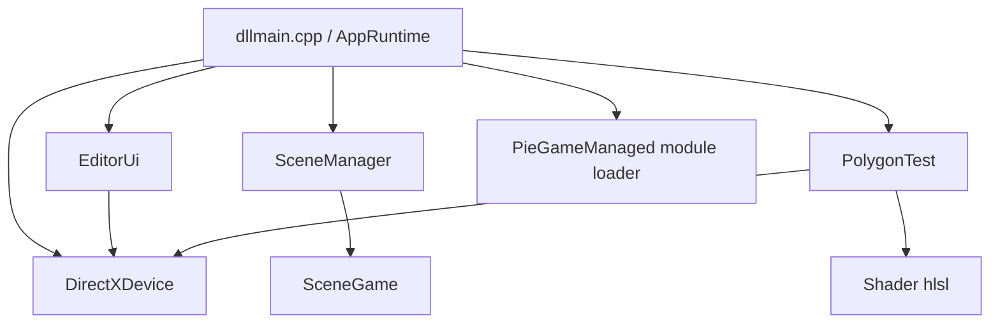
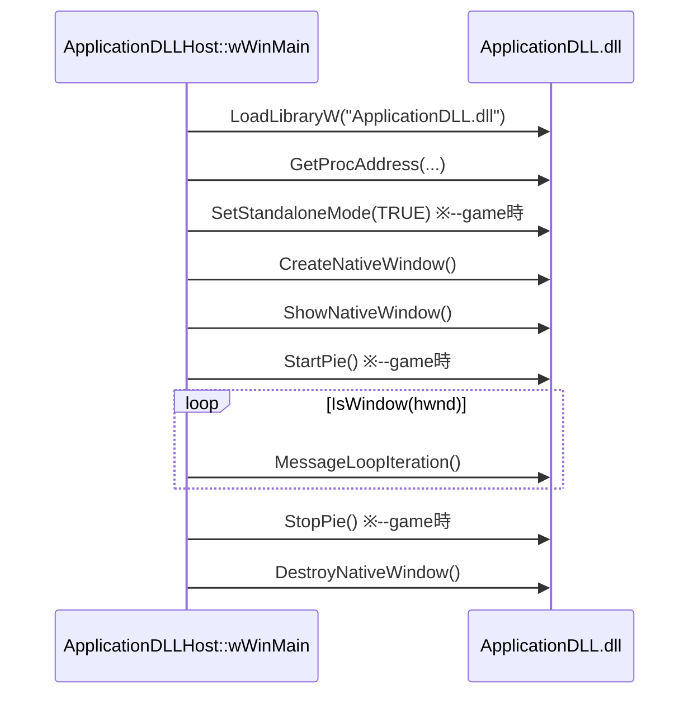
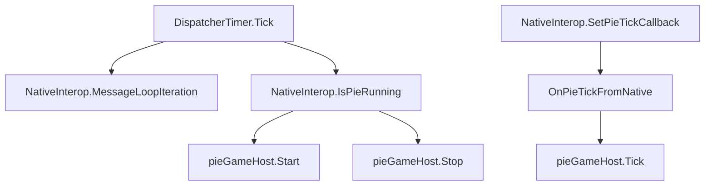
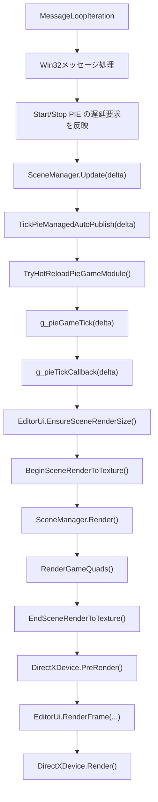
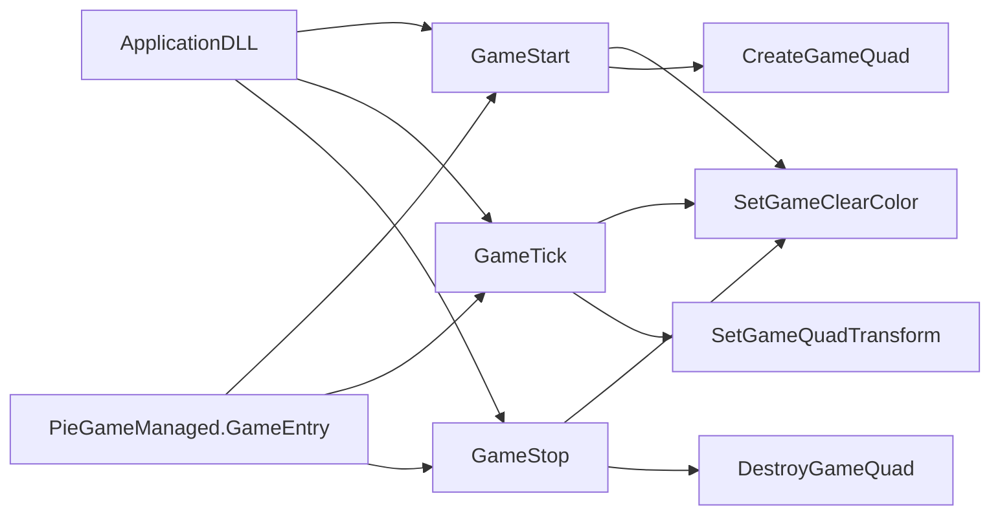
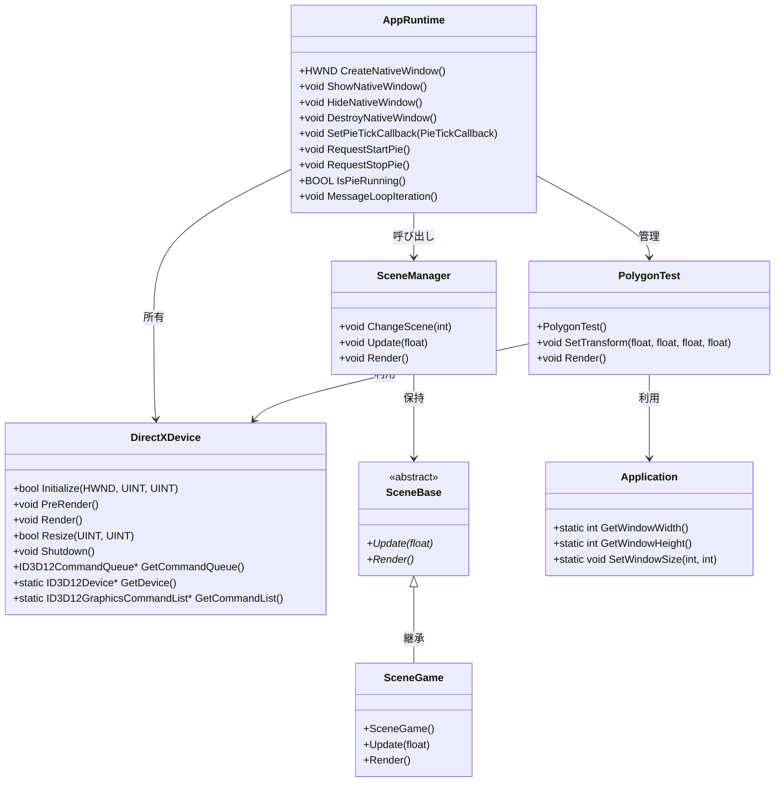
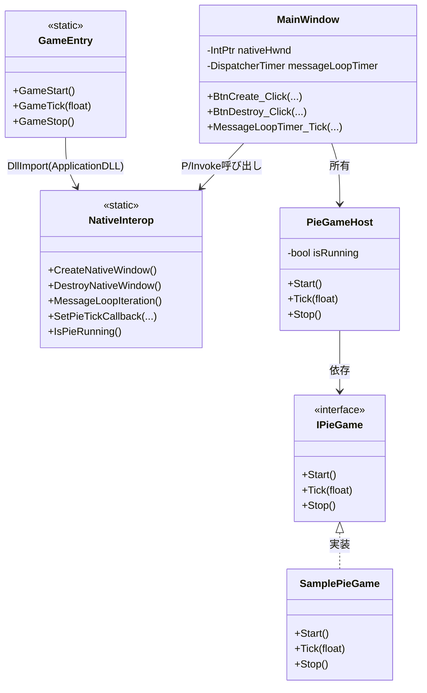

# DirectX12_Samples コード関係図

## 1. ソリューション全体のプロジェクト関係

## 2. ランタイムの呼び出しフロー（ApplicationDLL経路）

## 3. ApplicationDLL 内部モジュール関係

## 4. 関数レベル詳細図

### 4.1 ApplicationDLL のエクスポートAPI

```mermaid
graph TD
    EXP["ApplicationDLL exports"]
    C1["CreateNativeWindow"]
    C2["ShowNativeWindow"]
    C3["HideNativeWindow"]
    C4["DestroyNativeWindow"]
    C5["MessageLoopIteration"]
    C6["SetPieTickCallback"]
    C7["StartPie"]
    C8["StopPie"]
    C9["SetStandaloneMode"]
    C10["IsPieRunning"]
    C11["SetGameClearColor"]
    C12["CreateGameQuad"]
    C13["DestroyGameQuad"]
    C14["SetGameQuadTransform"]

    EXP --> C1
    EXP --> C2
    EXP --> C3
    EXP --> C4
    EXP --> C5
    EXP --> C6
    EXP --> C7
    EXP --> C8
    EXP --> C9
    EXP --> C10
    EXP --> C11
    EXP --> C12
    EXP --> C13
    EXP --> C14
```

### 4.2 ApplicationDLLHost 側の関数呼び出し順

### 4.3 Editor 側の関数呼び出し関係

### 4.4 MessageLoopIteration の内部処理

### 4.5 PIE（CSharp NativeAOT）双方向API

## 5. 現在コードから読み取れる要点

- `Editor` と `ApplicationDLLHost` はどちらも `ApplicationDLL` のフロントエンドで、実フレームループは `ApplicationDLL` 側にあります。
- `ApplicationDLL` は制御API（`CreateNativeWindow`、`MessageLoopIteration`、`StartPie`、`StopPie` など）を公開します。
- PIE は `PieGameManaged.dll` を動的ロードして `GameStart` / `GameTick` / `GameStop` を呼び出し、ホットリロードにも対応しています。
- `DirectX12_Samples` と `CommandListSimulation` は独立サンプルであり、`ApplicationDLL` 実行経路には直接参加しません。

## 6. クラス図

### 6.1 ApplicationDLL 中心

### 6.2 Editor / PIE 連携

