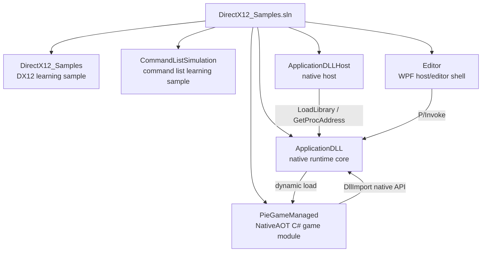
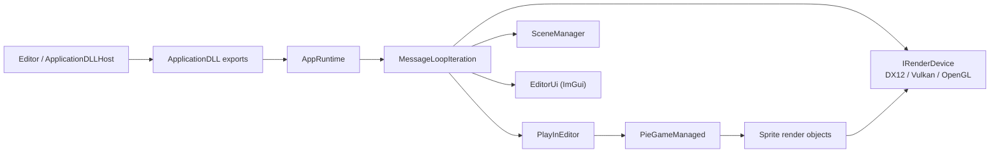

# DirectX12_Samples ソリューション設計解析

## 1. 概要

このソリューションは、単一のアプリケーションではなく、以下の3系統を同居させた構成です。

- DirectX 12 の学習用サンプル
- コマンドリスト概念の学習用サンプル
- `ApplicationDLL` を中核としたネイティブランタイム + エディタ + C# ゲームロジック実行基盤

現在の設計上の本命は、`ApplicationDLL` を中心にした実行基盤です。  
`DirectX12_Samples` と `CommandListSimulation` は独立した教材的プロジェクトであり、中核アーキテクチャには直接参加していません。

## 2. ソリューション構成

`DirectX12_Samples.sln` に含まれる主要プロジェクトは以下です。

- `DirectX12_Samples`
- `CommandListSimulation`
- `ApplicationDLL`
- `ApplicationDLLHost`
- `Editor`
- `PieGameManaged`

依存関係として明示的に見えるものは次の通りです。

- `Editor` は `ApplicationDLL` に依存
- `ApplicationDLLHost` は `ApplicationDLL` に依存
- `PieGameManaged` はソリューション上で独立しているが、実行時に `ApplicationDLL` からロードされる

## 3. 全体アーキテクチャ

全体は大きく3層です。

### 3.0 Mermaid 依存関係図

実行時の主要コンポーネントの流れは次の通りです。

### 3.1 ネイティブ基盤層

`ApplicationDLL` が担当します。

責務:

- Win32 ウィンドウ生成と破棄
- メッセージループ駆動
- 描画バックエンド管理
- ImGui ベースのエディタUI
- PIE の開始/停止制御
- C# 側ゲームDLLのロードとホットリロード
- スプライト描画オブジェクト管理

この層は DLL としてエクスポートされ、他プロジェクトから C 形式の公開APIで利用されます。

### 3.2 ホスト層

ホスト層には2種類あります。

- `ApplicationDLLHost`
- `Editor`

`ApplicationDLLHost` は薄いネイティブホストで、DLLをロードしてメインループを回すだけです。  
`Editor` は WPF 製のホストで、ネイティブウィンドウを埋め込みつつ UI コンテナとして振る舞います。

### 3.3 マネージドゲーム層

`PieGameManaged` が担当します。

責務:

- C# 側ゲームロジック実装
- シーン管理
- ゲームオブジェクトとコンポーネント管理
- ネイティブ描画オブジェクトへの同期

NativeAOT により共有ライブラリ化され、ネイティブから `GameStart` / `GameTick` / `GameStop` が呼ばれます。

## 4. プロジェクトごとの役割

### 4.1 ApplicationDLL

このソリューションの中核です。

主な設計要素:

- `dllmain.cpp`
  - 外部公開APIの入口
  - 実処理を `AppRuntime` に委譲
- `AppRuntime`
  - ランタイム全体のファサード
  - ウィンドウ、レンダラ、PIE、描画状態を管理
- `RuntimeState`
  - 実行時状態を一か所に集約したステートコンテナ
- `FrameLoop.cpp`
  - 1フレームごとの実行順序を定義
- `WindowHost.cpp`
  - Win32 ウィンドウ管理とレンダラ初期化
- `EditorUi`
  - ImGui によるUI描画
- `PlayInEditor`
  - PIEの開始/停止要求と実行状態管理

この構成から、`ApplicationDLL` は単なる描画DLLではなく、実行エンジンに近い位置づけです。

### 4.2 ApplicationDLLHost

薄いネイティブ実行ホストです。

責務:

- `ApplicationDLL.dll` の動的ロード
- エクスポート関数の解決
- `CreateNativeWindow` / `ShowNativeWindow` / `MessageLoopIteration` の呼び出し
- `--game` 指定時のスタンドアロンモード有効化

特徴:

- ランタイム本体は持たない
- すべての本質的な処理を `ApplicationDLL` に委譲

### 4.3 Editor

WPF 製エディタホストです。

責務:

- DLL存在確認やアーキテクチャ整合性チェック
- P/Invoke で `ApplicationDLL.dll` を呼び出す
- `DispatcherTimer` による擬似メインループ
- ネイティブウィンドウの埋め込み
- PIE 状態の監視

特徴:

- 実際の描画やゲーム更新の主体ではない
- UI シェル兼ホストとして設計されている

### 4.4 PieGameManaged

マネージド側ゲームロジック層です。

主な構成:

- `GameEntry`
  - ネイティブから呼ばれるエントリポイント
- `Scene`
  - `GameObject` 群のライフサイクル管理
- `GameObject`
  - コンポーネントの所有
- `Component`
  - `Awake` / `Start` / `Update` / `OnDestroy` の最小ライフサイクル
- `SpriteRenderer`
  - 描画用コンポーネント
- `SpriteRendererSystem`
  - C# 側スプライト情報をネイティブに同期

Unity 風の簡易ゲームオブジェクトモデルを意識した設計です。

### 4.5 DirectX12_Samples

単体の DirectX 12 初期化サンプルです。

責務:

- Win32 ウィンドウ生成
- D3D12 デバイス作成
- スワップチェーン、RTV、コマンドリストの基本処理

現行の `ApplicationDLL` 基盤とは独立しています。

### 4.6 CommandListSimulation

コマンドリストの考え方を簡単な `std::function` の列で模した学習用サンプルです。

## 5. 中核設計

### 5.1 公開API中心の構成

`ApplicationDLL` は C 形式のエクスポート関数を公開し、それらが `AppRuntime` を操作します。

代表的な公開API:

- ウィンドウ制御
  - `CreateNativeWindow`
  - `ShowNativeWindow`
  - `HideNativeWindow`
  - `DestroyNativeWindow`
- PIE制御
  - `SetPieTickCallback`
  - `StartPie`
  - `StopPie`
  - `IsPieRunning`
- 描画制御
  - `SetRendererBackend`
  - `GetRendererBackend`
  - `SetGameClearColor`
- スプライト操作
  - `CreateSpriteRenderer`
  - `DestroySpriteRenderer`
  - `SetSpriteRendererTransform`
  - `SetSpriteRendererTexture`
  - `SetSpriteRendererMaterial`

この構成の利点は、ホストの実装言語やUI方式を問わず、同じランタイムを再利用できる点です。

### 5.2 RuntimeState 集約型

`RuntimeState` には以下が集約されています。

- 現在のウィンドウ
- 現在のレンダーデバイス
- ImGui 初期化状態
- PIE モジュール状態
- ホットリロード監視情報
- スプライト描画オブジェクト群
- 描画バックエンド状態

利点:

- 状態の見通しがよい
- 実装速度が速い

弱点:

- グローバル状態依存が強い
- 機能追加時に結合が増えやすい
- テストしにくい

## 6. フレームループ設計

`AppRuntime::MessageLoopIteration()` がアプリ全体の実行順序を制御しています。

概略順序:

1. Win32 メッセージ処理
2. 保留中のレンダラ切替適用
3. PIE 状態更新
4. ネイティブ `SceneManager` 更新
5. C# 側自動 publish / ホットリロード確認
6. シーン描画
7. スプライト描画
8. ImGui UI 描画
9. バックエンドの最終 `Render()`

この設計により、ネイティブシーン、C#ゲームロジック、UI、レンダラ抽象がすべて1つのフレームループに統合されています。

## 7. レンダリング設計

### 7.1 バックエンド抽象

描画層は `IRenderDevice` で抽象化されています。

想定バックエンド:

- DirectX 12
- Vulkan
- OpenGL

共通責務:

- 初期化
- 終了処理
- リサイズ
- 事前描画
- 最終描画
- ImGui の描画コンテキスト準備

### 7.2 バックエンド切り替え

レンダラ切り替えは即時ではなく、フレームループ中に保留要求として処理されます。

処理内容:

- PIE 停止
- 既存レンダラとUIの破棄
- 必要ならウィンドウ再生成
- 新バックエンドで再初期化
- 必要なら PIE 再開

これは安全側の設計で、レンダリングコンテキスト差し替え時の事故を減らしています。

### 7.3 スプライト描画

スプライトはネイティブ側でハンドル管理されます。

構成:

- C# 側 `SpriteRenderer`
- C# 側 `SpriteRendererSystem`
- ネイティブ側 `ISpriteRenderObject`
- バックエンド別スプライト実装

流れ:

1. C# が `SpriteRenderer` を保持
2. `SpriteRendererSystem` がネイティブ `CreateSpriteRenderer()` を呼ぶ
3. テクスチャ、マテリアル、変換情報をネイティブへ同期
4. ネイティブ描画ループで各スプライトを描画

この方式により、ロジックは C#、描画実体はネイティブという分担になっています。

## 8. PIE 設計

PIE は `PlayInEditor` が管理します。

責務:

- Start/Stop 要求の受付
- 即時起動・即時停止
- 実行中 `GameTick` 呼び出し
- Editor 向け Tick コールバック呼び出し

PIE 開始時:

- `PieGameManaged.dll` をロード
- `GameStart` を呼ぶ
- 状態を running に変更

PIE 停止時:

- `GameStop` を呼ぶ
- 全スプライト破棄
- publish/ホットリロード状態リセット
- DLL アンロード

## 9. C# ゲーム層の設計

### 9.1 モデル

`PieGameManaged` は、簡易的なコンポーネントベースモデルを持ちます。

基本モデル:

- `Scene`
  - `GameObject` の集合
- `GameObject`
  - `Transform` と `Component` 群を所有
- `Component`
  - ライフサイクルを持つ振る舞い

### 9.2 現状のサンプル実装

`GameEntry.CreateScene()` では、現在以下のような最小構成を作っています。

- Player オブジェクト生成
- `SpriteRenderer` 追加
- `PlayerPulseController` 追加

`PlayerPulseController` は以下を行います。

- 背景色の周期変化
- スプライトの位置とサイズの周期変化

つまり現状は、C# 側でロジックを更新し、その結果をネイティブ描画に反映するサンプルになっています。

## 10. データと責務の流れ

全体の責務の流れは以下です。

### 起動

- `Editor` または `ApplicationDLLHost` が起動
- `ApplicationDLL.dll` をロード
- ネイティブウィンドウ生成
- 選択レンダラ初期化
- 必要に応じて PIE 開始

### フレーム更新

- ホストが `MessageLoopIteration()` を呼ぶ
- `ApplicationDLL` が全体進行を担当
- PIE 中は C# 側 `GameTick()` が呼ばれる
- C# 側がネイティブ描画情報を更新
- ネイティブが描画を完了

### 終了

- PIE 停止
- ネイティブ描画リソース解放
- ウィンドウ破棄

## 11. 設計上の評価

### 良い点

- `ApplicationDLL` を中心にした責務集約が明確
- ホストを差し替えやすい
- 描画バックエンド抽象化ができている
- C# ロジック層とネイティブ描画層の分離ができている
- NativeAOT によりネイティブ連携が比較的単純

### 気になる点

- `RuntimeState` が大きく、状態管理が集中しすぎている
- `ApplicationDLL` がウィンドウ、描画、PIE、ホットリロード、UI を抱えており責務が広い
- ネイティブ `SceneManager` はまだ薄く、C# 側との役割整理が将来必要
- `Editor` 側にも `PieGameHost` が残っており、現行 NativeAOT ベースの PIE と役割がやや重複している

## 12. 現時点での設計理解

現状のアーキテクチャは、以下の一文で要約できます。

`ApplicationDLL` をネイティブ実行基盤とし、その上に WPF エディタホストまたは単体ホストを載せ、ゲームロジックは NativeAOT 化した C# DLL で差し替える構成。

学習用サンプルを残しつつ、実験的な小型ゲームエディタ/ランタイムとして発展させている段階の設計です。

## 13. PipelineLibrary の役割

### 13.1 ひとことで言うと

`PipelineLibrary` は、DirectX 12 の「描画設定一式」をまとめて作り、同じ設定なら再利用するためのキャッシュです。

初心者向けに言い換えると、これは「描画レシピの保管庫」です。

- どのシェーダーを使うか
- 頂点データをどう読むか
- ブレンドを有効にするか
- 深度テストを使うか
- どんなルートシグネチャにするか

こういった設定を毎回バラバラに作るのではなく、1つのまとまりとして扱っています。

### 13.2 なぜ必要か

DirectX 12 では、描画前にたくさんの設定を組み合わせて `Pipeline State Object` というものを作ります。  
これは「この設定で描画する」という確定済みの描画モードです。

ただし PSO 作成は軽い処理ではありません。  
毎フレーム、毎オブジェクトごとに作るようなものではなく、できるだけ再利用したい種類のデータです。

そこで `PipelineLibrary` が次を担当します。

- 同じ設定の PSO を重複作成しない
- ルートシグネチャと PSO をセットで管理する
- 必要になったときだけ作る
- すでに作成済みならキャッシュから返す

### 13.3 このプロジェクトで何を保存しているか

`PipelineLibrary::PipelineDesc` には、主に次の情報が入ります。

- 頂点シェーダーファイル名
- ピクセルシェーダーファイル名
- エントリポイント名
- シェーダーモデル
- レンダーターゲットのフォーマット
- カリング設定
- トポロジ種別
- 深度有効/無効
- ブレンド有効/無効
- 頂点レイアウト
- ルートパラメータ
- 静的サンプラ

つまり `PipelineDesc` は、「この描画を成立させるための設計図」です。

### 13.4 実際の処理の流れ

`Material` が描画用の設定を組み立てて、`PipelineLibrary` に渡します。

流れは次の通りです。

1. `Material` が `PipelineDesc` を作る
2. `PipelineLibrary.GetOrCreate()` を呼ぶ
3. すでに同じ設定がキャッシュにあればそれを返す
4. なければシェーダーをコンパイルする
5. ルートシグネチャを作る
6. `CreateGraphicsPipelineState()` で PSO を作る
7. 結果をキャッシュに保存する

その後、`Material::Bind()` で実際のコマンドリストに PSO とルートシグネチャをセットします。

### 13.5 このコードベースでの位置づけ

現状では `QuadRenderObject` が `Material` を初期化するときに `PipelineLibrary` を使っています。

役割分担は次のようになっています。

- `QuadRenderObject`
  - 四角形メッシュを持つ
- `Material`
  - その四角形をどんな見た目で描くかを表す
- `PipelineLibrary`
  - その見た目に必要な DX12 パイプラインを生成・再利用する

つまり、

- `QuadRenderObject` は「何を描くか」
- `Material` は「どう描くか」
- `PipelineLibrary` は「どう描くかを GPU 用の実体に変換して使い回す」

という関係です。

### 13.6 具体例

たとえば「テクスチャ付き四角形を描く」というケースでは、`Material::CreateBuiltInTexturedQuadDesc()` が次のような条件を決めます。

- 頂点シェーダーは `BasicVertexShader.hlsl`
- ピクセルシェーダーは `BasicPixelShader.hlsl`
- 頂点には `POSITION` と `TEXCOORD` がある
- ピクセルシェーダーで SRV テクスチャを1つ使う
- サンプラは point sampling
- 深度は使わない
- ブレンドは無効

この条件が `PipelineDesc` です。  
`PipelineLibrary` はこれを見て、「この条件の PSO はもうあるか」を確認します。

- あれば再利用
- なければ新規作成

### 13.7 初心者向けのイメージ

料理にたとえると次のようになります。

- `QuadRenderObject` は「食材」
- `Material` は「レシピ」
- `PipelineLibrary` は「そのレシピに対応する調理器具セットを倉庫から出す係」

同じ料理を何度も作るたびに、毎回コンロやフライパンを新調していたら無駄です。  
`PipelineLibrary` は、同じレシピなら同じ器具セットを使い回す役目です。

### 13.8 この実装の良い点

- 同じパイプラインを何度も作らずに済む
- マテリアル側の責務を単純化できる
- PSO とルートシグネチャをひとまとめに扱える
- 将来的にマテリアル種類が増えても拡張しやすい

### 13.9 注意点

現状の `PipelineLibrary` は便利ですが、いくつか前提があります。

- DX12 専用の実装
- キャッシュキーは `PipelineDesc` の完全一致
- シェーダーコンパイルフラグが現状はデバッグ寄り
- 永続保存ではなく、実行中メモリ上のキャッシュ

つまり今は「起動中だけ使う簡易パイプラインキャッシュ」です。  
ディスクに保存する本格的な D3D12 Pipeline Library とは別物です。

### 13.10 まとめ

`PipelineLibrary` は、DirectX 12 の複雑な描画設定を毎回その場で組み立てるのではなく、
「設定の組をキーにして PSO とルートシグネチャを作って再利用する」ための部品です。

初心者にとっての理解ポイントは次の1点です。

「GPU にどう描かせるかの設定は重いので、`PipelineLibrary` がまとめて作って使い回している」

と考えると、このクラスの役割をつかみやすいです。

## 14. 今後の整理案

今後さらに整理するなら、次の分割が有効です。

- `ApplicationDLL`
  - `Runtime`
  - `Windowing`
  - `Rendering`
  - `EditorUi`
  - `PieRuntime`
  - `ManagedBridge`
- `PieGameManaged`
  - `Core`
  - `Scene`
  - `RenderingSync`
  - `Game`

特に `RuntimeState` の分割と、PIE関連機能の独立モジュール化を進めると、保守性が上がります。
