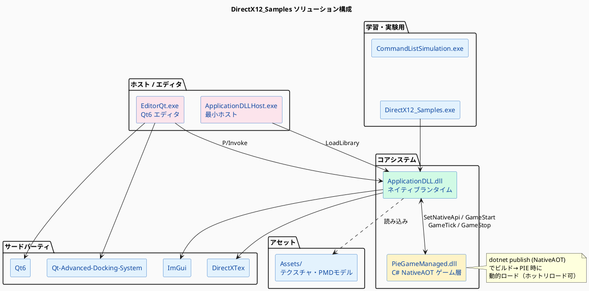

# プロジェクト概要

## 目的

DirectX12 の学習・実験を目的としたゲームエンジン実装プロジェクト。  
Unity ライクな GameObject / Component アーキテクチャを採用し、C# でゲームロジックを記述しながらネイティブ (C++) でレンダリングを行う構成。

## 技術スタック

| カテゴリ | 技術 |
|--------|------|
| レンダリング | DirectX 12 (メイン) / Vulkan / OpenGL |
| シェーダー | HLSL (DirectX12), GLSL (Vulkan/OpenGL) |
| ゲームロジック言語 | C# (.NET 8, NativeAOT) |
| ランタイム言語 | C++ (Visual Studio 2022, x64) |
| エディタ UI | Qt 6.8 + Qt Advanced Docking System |
| エディタ内蔵 UI | ImGui |
| 3D モデル | PMD 形式 |
| テクスチャ | DirectXTex |
| ビルドシステム | MSBuild (.vcxproj) + CMake (EditorQt) |

## ソリューション構成



## サブプロジェクト役割一覧

| プロジェクト | 種別 | 役割 |
|------------|------|------|
| `ApplicationDLL` | DLL (C++) | ウィンドウ管理・レンダリング・PIE制御・ImGui UI の中核 |
| `PieGameManaged` | DLL (C# NativeAOT) | ゲームオブジェクト・コンポーネント・シーン管理 |
| `EditorQt` | EXE (C++/Qt6) | 次世代エディタフロントエンド（現行メイン） |
| `ApplicationDLLHost` | EXE (C++) | ApplicationDLL の最小ホスト (デバッグ・CI 用途) |
| `DirectX12_Samples` | EXE (C++) | DirectX12 API の個別学習サンプル |
| `CommandListSimulation` | EXE (C++) | コマンドキューの概念学習用シミュレーション |
| `Editor` | EXE (WPF/C#) | レガシーエディタ（現在非アクティブ） |

## ディレクトリ構成

```
DirectX12_Samples/
├── ApplicationDLL/          # C++ ネイティブランタイム
│   ├── RHI/                 #   レンダーハードウェアインターフェース
│   ├── Renderer/            #   描画バックエンド (DX12/Vulkan/GL)
│   ├── SpriteRenderers/     #   スプライト描画バックエンド
│   ├── Scene/               #   シーン管理
│   ├── Editor/              #   ImGui エディタUI + PIE制御
│   ├── Analyzer/            #   PMD モデル解析
│   ├── Math/                #   行列・ベクトル計算
│   └── Shader/              #   HLSL シェーダー
├── PieGameManaged/          # C# ゲームロジック層
├── EditorQt/                # Qt6 エディタ
│   └── src/                 #   ソースコード
├── ApplicationDLLHost/      # 最小ホスト
├── DirectX12_Samples/       # 学習サンプル
├── CommandListSimulation/   # コマンドリスト学習
├── Assets/                  # テクスチャ・モデルリソース
│   ├── Texture/
│   └── Model/
├── ThirdParty/              # 外部ライブラリ
│   ├── DirectXTex/
│   ├── imgui/
│   └── Qt-Advanced-Docking-System/
└── Documents/               # 設計ドキュメント
```
