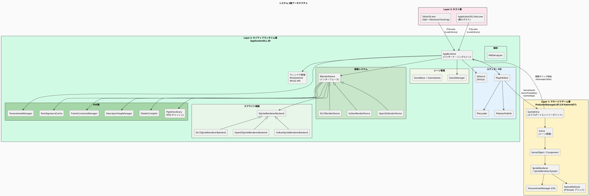
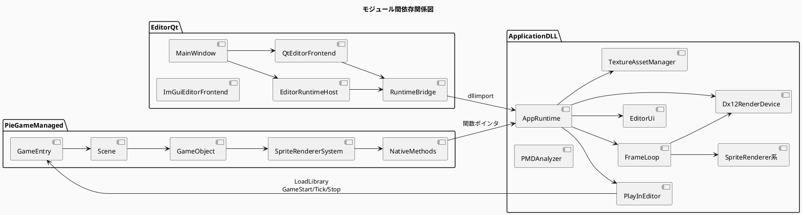
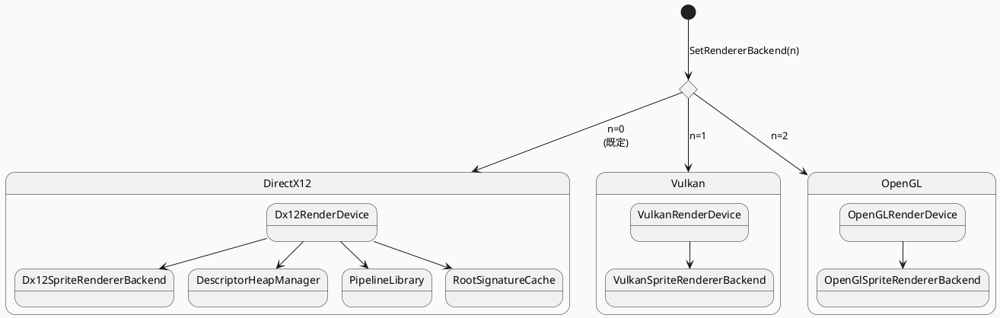
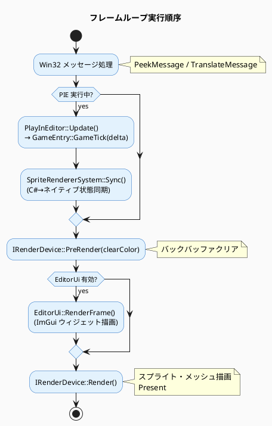

# レイヤーアーキテクチャ

## 3層アーキテクチャ全体図

```plantuml
@startuml
skinparam backgroundColor #FAFAFA
skinparam defaultFontName "Meiryo UI"

title システム 3層アーキテクチャ

rectangle "Layer 3: ホスト層" #FCE4EC {
  rectangle "EditorQt.exe\n(Qt6 + Advanced Docking)" as EditorQt
  rectangle "ApplicationDLLHost.exe\n(最小ホスト)" as Host
}

rectangle "Layer 2: ネイティブランタイム層\nApplicationDLL.dll" #D1FAE5 {
  rectangle "AppRuntime\n(ファサード・シングルトン)" as AppRuntime

  rectangle "ウィンドウ管理\nWindowHost\nWin32 API" as Win32

  rectangle "描画システム" #C8E6C9 {
    rectangle "IRenderDevice\n(インターフェース)" as IRD
    rectangle "Dx12RenderDevice" as DX12
    rectangle "VulkanRenderDevice" as VK
    rectangle "OpenGLRenderDevice" as GL
    IRD <|-- DX12
    IRD <|-- VK
    IRD <|-- GL
  }

  rectangle "RHI層" #A5D6A7 {
    rectangle "DescriptorHeapManager" as DHM
    rectangle "TextureAssetManager" as TAM
    rectangle "ShaderCompiler" as SC
    rectangle "PipelineLibrary\n(PSO キャッシュ)" as PL
    rectangle "RootSignatureCache" as RSC
    rectangle "FrameConstantsManager" as FCM
  }

  rectangle "スプライト描画" #E8F5E9 {
    rectangle "ISpriteRendererBackend" as ISRB
    rectangle "Dx12SpriteRendererBackend" as D12SRB
    rectangle "OpenGlSpriteRendererBackend" as GLSRB
    rectangle "VulkanSpriteRendererBackend" as VKB
    ISRB <|-- D12SRB
    ISRB <|-- GLSRB
    ISRB <|-- VKB
  }

  rectangle "シーン管理" #F1F8E9 {
    rectangle "SceneManager" as SM
    rectangle "SceneBase → SceneGame" as SG
  }

  rectangle "エディタ + PIE" #E3F2FD {
    rectangle "EditorUi\n(ImGui)" as EditorUi
    rectangle "PlayInEditor" as PIE
    rectangle "PieLoader" as PLoader
    rectangle "PieAutoPublish" as PubAuto
  }

  rectangle "解析" {
    rectangle "PMDAnalyzer" as PMD
  }

  AppRuntime --> Win32
  AppRuntime --> IRD
  AppRuntime --> SM
  AppRuntime --> EditorUi
  AppRuntime --> PIE
  AppRuntime --> TAM
  IRD --> DHM
  IRD --> SC
  IRD --> PL
  IRD --> RSC
  IRD --> FCM
  IRD --> ISRB
  PIE --> PLoader
  PIE --> PubAuto
}

rectangle "Layer 1: マネージドゲーム層\nPieGameManaged.dll (C# NativeAOT)" #FEF3C7 {
  rectangle "GameEntry\n(エクスポートエントリーポイント)" as GameEntry
  rectangle "Scene\n(シーン管理)" as Scene
  rectangle "GameObject / Component" as GOC
  rectangle "SpriteRenderer\n+ SpriteRendererSystem" as SRS
  rectangle "TextureAssetManager (C#)" as TAM_CS
  rectangle "NativeMethods\n(P/Invoke ブリッジ)" as NM
  GameEntry --> Scene
  Scene --> GOC
  GOC --> SRS
  SRS --> TAM_CS
  SRS --> NM
}

EditorQt --> AppRuntime : P/Invoke\n(LoadLibrary)
Host --> AppRuntime : P/Invoke\n(LoadLibrary)
PIE --> GameEntry : GameStart()\nGameTick(delta)\nGameStop()
GameEntry --> AppRuntime : 関数ポインタ経由\n(NativeApiTable)

@enduml
```

## モジュール間依存関係

```plantuml
@startuml
skinparam backgroundColor #FAFAFA
left to right direction

title モジュール間依存関係図

package "EditorQt" {
  [MainWindow]
  [EditorRuntimeHost]
  [RuntimeBridge]
  [QtEditorFrontend]
  [ImGuiEditorFrontend]
}

package "ApplicationDLL" {
  [AppRuntime] as AR
  [FrameLoop] as FL
  [PlayInEditor] as PIE
  [EditorUi] as EU
  [Dx12RenderDevice] as DX12
  [SpriteRenderer系] as SR
  [TextureAssetManager] as TAM
  [PMDAnalyzer] as PMD
}

package "PieGameManaged" {
  [GameEntry] as GE
  [Scene] as SCN
  [GameObject] as GO
  [SpriteRendererSystem] as SRS
  [NativeMethods] as NM
}

[MainWindow] --> [EditorRuntimeHost]
[EditorRuntimeHost] --> [RuntimeBridge]
[RuntimeBridge] --> AR : dllimport
[MainWindow] --> [QtEditorFrontend]
[QtEditorFrontend] --> [RuntimeBridge]

AR --> FL
AR --> PIE
AR --> EU
AR --> DX12
AR --> TAM
FL --> DX12
FL --> SR
PIE --> GE : LoadLibrary\nGameStart/Tick/Stop
GE --> SCN
SCN --> GO
GO --> SRS
SRS --> NM
NM --> AR : 関数ポインタ

@enduml
```

## レンダリングバックエンド切り替え

実行時に `SetRendererBackend(backend)` を呼ぶことで切り替え可能。

```plantuml
@startuml
skinparam backgroundColor #FAFAFA

state "レンダリングバックエンド選択" as choice <<choice>>

[*] --> choice : SetRendererBackend(n)

choice --> DirectX12 : n=0\n(既定)
choice --> Vulkan : n=1
choice --> OpenGL : n=2

state DirectX12 {
  Dx12RenderDevice --> Dx12SpriteRendererBackend
  Dx12RenderDevice --> DescriptorHeapManager
  Dx12RenderDevice --> PipelineLibrary
  Dx12RenderDevice --> RootSignatureCache
}

state Vulkan {
  VulkanRenderDevice --> VulkanSpriteRendererBackend
}

state OpenGL {
  OpenGLRenderDevice --> OpenGlSpriteRendererBackend
}

@enduml
```

## フレームループ実行順序

`FrameLoop` クラスがフレームごとの処理順を定義する。

```plantuml
@startuml
skinparam backgroundColor #FAFAFA
skinparam activityBackgroundColor #E3F2FD
skinparam activityBorderColor #1565C0

title フレームループ実行順序

start

:Win32 メッセージ処理;
note right: PeekMessage / TranslateMessage

if (PIE 実行中?) then (yes)
  :PlayInEditor::Update()\n→ GameEntry::GameTick(delta);
  :SpriteRendererSystem::Sync()\n(C#→ネイティブ状態同期);
endif

:IRenderDevice::PreRender(clearColor);
note right: バックバッファクリア

if (EditorUi 有効?) then (yes)
  :EditorUi::RenderFrame()\n(ImGui ウィジェット描画);
endif

:IRenderDevice::Render();
note right: スプライト・メッシュ描画\nPresent

stop

@enduml
```
