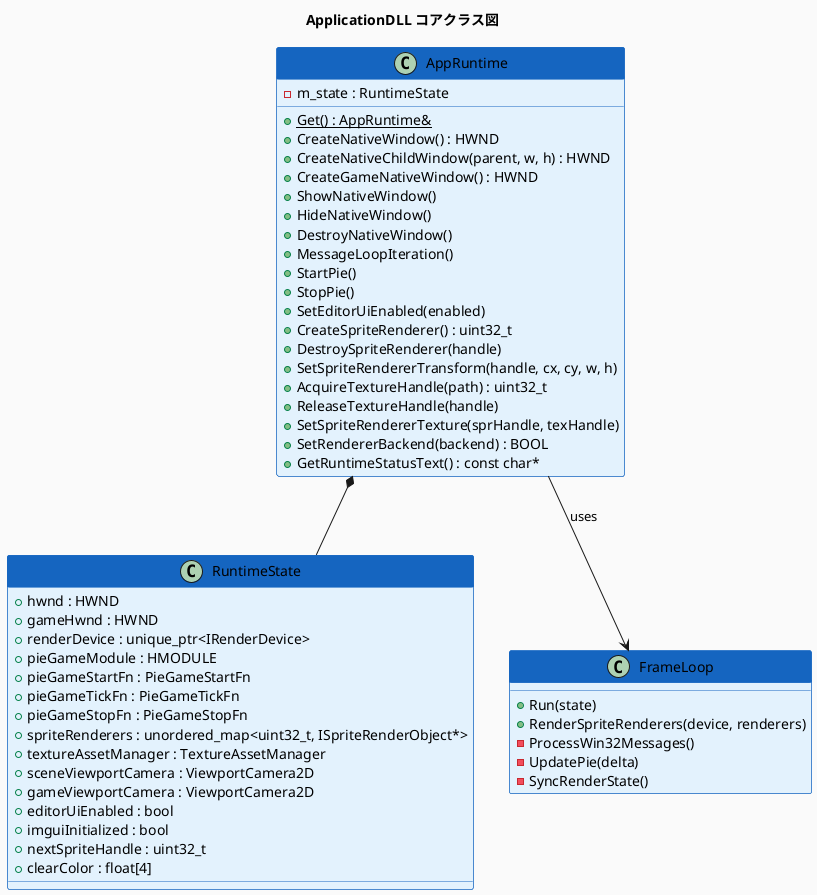
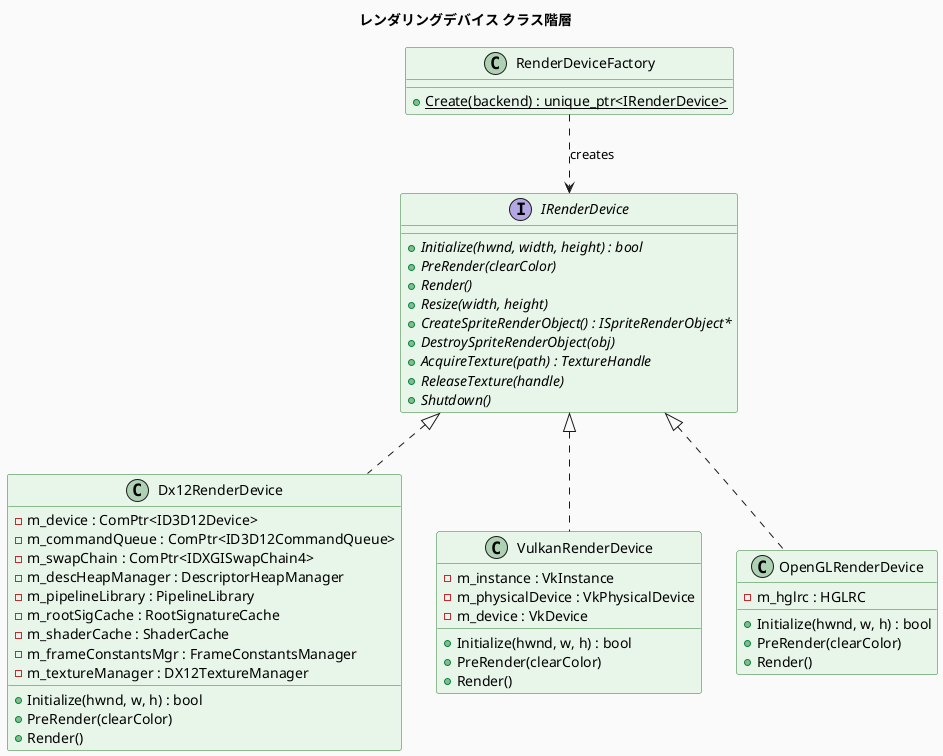
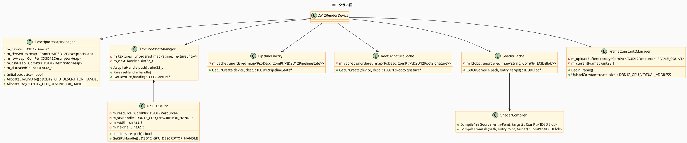
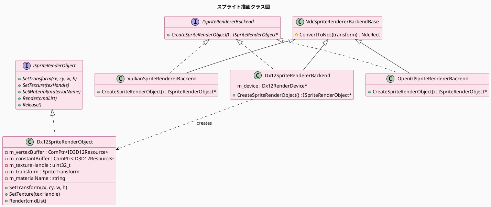
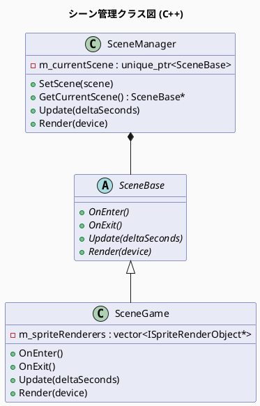
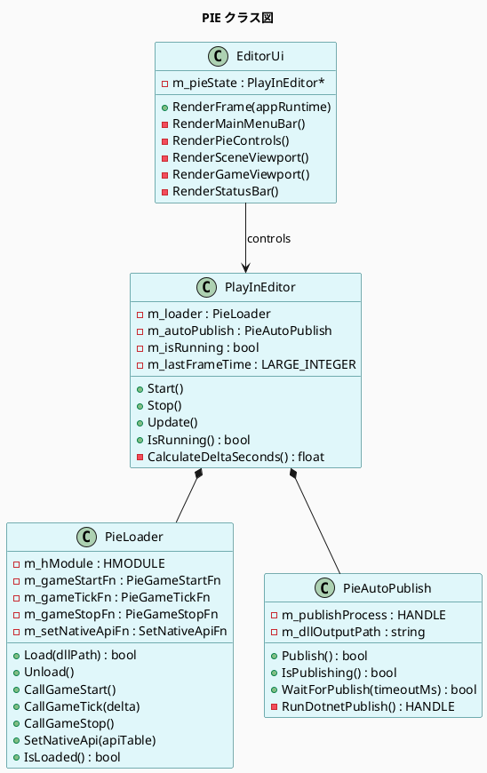

# クラス図 - ApplicationDLL (C++ ネイティブ側)

## コアクラス図

```plantuml
@startuml
skinparam backgroundColor #FAFAFA
skinparam classBackgroundColor #E3F2FD
skinparam classBorderColor #1565C0
skinparam classHeaderBackgroundColor #1565C0
skinparam classHeaderFontColor white

title ApplicationDLL コアクラス図

class AppRuntime {
  + {static} Get() : AppRuntime&
  + CreateNativeWindow() : HWND
  + CreateNativeChildWindow(parent, w, h) : HWND
  + CreateGameNativeWindow() : HWND
  + ShowNativeWindow()
  + HideNativeWindow()
  + DestroyNativeWindow()
  + MessageLoopIteration()
  + StartPie()
  + StopPie()
  + SetEditorUiEnabled(enabled)
  + CreateSpriteRenderer() : uint32_t
  + DestroySpriteRenderer(handle)
  + SetSpriteRendererTransform(handle, cx, cy, w, h)
  + AcquireTextureHandle(path) : uint32_t
  + ReleaseTextureHandle(handle)
  + SetSpriteRendererTexture(sprHandle, texHandle)
  + SetRendererBackend(backend) : BOOL
  + GetRuntimeStatusText() : const char*
  - m_state : RuntimeState
}

class RuntimeState {
  + hwnd : HWND
  + gameHwnd : HWND
  + renderDevice : unique_ptr<IRenderDevice>
  + pieGameModule : HMODULE
  + pieGameStartFn : PieGameStartFn
  + pieGameTickFn : PieGameTickFn
  + pieGameStopFn : PieGameStopFn
  + spriteRenderers : unordered_map<uint32_t, ISpriteRenderObject*>
  + textureAssetManager : TextureAssetManager
  + sceneViewportCamera : ViewportCamera2D
  + gameViewportCamera : ViewportCamera2D
  + editorUiEnabled : bool
  + imguiInitialized : bool
  + nextSpriteHandle : uint32_t
  + clearColor : float[4]
}

AppRuntime *-- RuntimeState

class FrameLoop {
  + Run(state)
  + RenderSpriteRenderers(device, renderers)
  - ProcessWin32Messages()
  - UpdatePie(delta)
  - SyncRenderState()
}

AppRuntime --> FrameLoop : uses

@enduml
```

## レンダリングデバイス クラス図

```plantuml
@startuml
skinparam backgroundColor #FAFAFA
skinparam classBackgroundColor #E8F5E9
skinparam classBorderColor #2E7D32

title レンダリングデバイス クラス階層

interface IRenderDevice {
  + {abstract} Initialize(hwnd, width, height) : bool
  + {abstract} PreRender(clearColor)
  + {abstract} Render()
  + {abstract} Resize(width, height)
  + {abstract} CreateSpriteRenderObject() : ISpriteRenderObject*
  + {abstract} DestroySpriteRenderObject(obj)
  + {abstract} AcquireTexture(path) : TextureHandle
  + {abstract} ReleaseTexture(handle)
  + {abstract} Shutdown()
}

class Dx12RenderDevice {
  - m_device : ComPtr<ID3D12Device>
  - m_commandQueue : ComPtr<ID3D12CommandQueue>
  - m_swapChain : ComPtr<IDXGISwapChain4>
  - m_descHeapManager : DescriptorHeapManager
  - m_pipelineLibrary : PipelineLibrary
  - m_rootSigCache : RootSignatureCache
  - m_shaderCache : ShaderCache
  - m_frameConstantsMgr : FrameConstantsManager
  - m_textureManager : DX12TextureManager
  + Initialize(hwnd, w, h) : bool
  + PreRender(clearColor)
  + Render()
}

class VulkanRenderDevice {
  - m_instance : VkInstance
  - m_physicalDevice : VkPhysicalDevice
  - m_device : VkDevice
  + Initialize(hwnd, w, h) : bool
  + PreRender(clearColor)
  + Render()
}

class OpenGLRenderDevice {
  - m_hglrc : HGLRC
  + Initialize(hwnd, w, h) : bool
  + PreRender(clearColor)
  + Render()
}

class RenderDeviceFactory {
  + {static} Create(backend) : unique_ptr<IRenderDevice>
}

IRenderDevice <|.. Dx12RenderDevice
IRenderDevice <|.. VulkanRenderDevice
IRenderDevice <|.. OpenGLRenderDevice
RenderDeviceFactory ..> IRenderDevice : creates

@enduml
```

## RHI (レンダーハードウェアインターフェース) クラス図

```plantuml
@startuml
skinparam backgroundColor #FAFAFA
skinparam classBackgroundColor #FFF8E1
skinparam classBorderColor #F57F17

title RHI クラス図

class DescriptorHeapManager {
  - m_device : ID3D12Device*
  - m_cbvSrvUavHeap : ComPtr<ID3D12DescriptorHeap>
  - m_rtvHeap : ComPtr<ID3D12DescriptorHeap>
  - m_dsvHeap : ComPtr<ID3D12DescriptorHeap>
  - m_allocatedCount : uint32_t
  + Initialize(device) : bool
  + AllocateCbvSrvUav() : D3D12_CPU_DESCRIPTOR_HANDLE
  + AllocateRtv() : D3D12_CPU_DESCRIPTOR_HANDLE
}

class TextureAssetManager {
  - m_textures : unordered_map<string, TextureEntry>
  + AcquireHandle(path) : uint32_t
  + ReleaseHandle(handle)
  + GetTexture(handle) : DX12Texture*
  - m_nextHandle : uint32_t
}

class DX12Texture {
  - m_resource : ComPtr<ID3D12Resource>
  - m_srvHandle : D3D12_CPU_DESCRIPTOR_HANDLE
  - m_width : uint32_t
  - m_height : uint32_t
  + Load(device, path) : bool
  + GetSRVHandle() : D3D12_GPU_DESCRIPTOR_HANDLE
}

class ShaderCompiler {
  + Compile(hlslSource, entryPoint, target) : ComPtr<ID3DBlob>
  + CompileFromFile(path, entryPoint, target) : ComPtr<ID3DBlob>
}

class PipelineLibrary {
  - m_cache : unordered_map<PsoDesc, ComPtr<ID3D12PipelineState>>
  + GetOrCreate(device, desc) : ID3D12PipelineState*
}

class RootSignatureCache {
  - m_cache : unordered_map<RsDesc, ComPtr<ID3D12RootSignature>>
  + GetOrCreate(device, desc) : ID3D12RootSignature*
}

class ShaderCache {
  - m_blobs : unordered_map<string, ComPtr<ID3DBlob>>
  + GetOrCompile(path, entry, target) : ID3DBlob*
}

class FrameConstantsManager {
  - m_uploadBuffers : array<ComPtr<ID3D12Resource>, FRAME_COUNT>
  - m_currentFrame : uint32_t
  + BeginFrame()
  + UploadConstants(data, size) : D3D12_GPU_VIRTUAL_ADDRESS
}

TextureAssetManager *-- DX12Texture
Dx12RenderDevice --> DescriptorHeapManager
Dx12RenderDevice --> PipelineLibrary
Dx12RenderDevice --> RootSignatureCache
Dx12RenderDevice --> ShaderCache
Dx12RenderDevice --> FrameConstantsManager
Dx12RenderDevice --> TextureAssetManager
ShaderCache --> ShaderCompiler

@enduml
```

## スプライト描画クラス図

```plantuml
@startuml
skinparam backgroundColor #FAFAFA
skinparam classBackgroundColor #FCE4EC
skinparam classBorderColor #880E4F

title スプライト描画クラス図

interface ISpriteRenderObject {
  + {abstract} SetTransform(cx, cy, w, h)
  + {abstract} SetTexture(texHandle)
  + {abstract} SetMaterial(materialName)
  + {abstract} Render(cmdList)
  + {abstract} Release()
}

class Dx12SpriteRenderObject {
  - m_vertexBuffer : ComPtr<ID3D12Resource>
  - m_constantBuffer : ComPtr<ID3D12Resource>
  - m_textureHandle : uint32_t
  - m_transform : SpriteTransform
  - m_materialName : string
  + SetTransform(cx, cy, w, h)
  + SetTexture(texHandle)
  + Render(cmdList)
}

interface ISpriteRendererBackend {
  + {abstract} CreateSpriteRenderObject() : ISpriteRenderObject*
}

class Dx12SpriteRendererBackend {
  - m_device : Dx12RenderDevice*
  + CreateSpriteRenderObject() : ISpriteRenderObject*
}

class OpenGlSpriteRendererBackend {
  + CreateSpriteRenderObject() : ISpriteRenderObject*
}

class VulkanSpriteRendererBackend {
  + CreateSpriteRenderObject() : ISpriteRenderObject*
}

class NdcSpriteRendererBackendBase {
  # ConvertToNdc(transform) : NdcRect
}

ISpriteRenderObject <|.. Dx12SpriteRenderObject

ISpriteRendererBackend <|.. Dx12SpriteRendererBackend
ISpriteRendererBackend <|.. OpenGlSpriteRendererBackend
ISpriteRendererBackend <|.. VulkanSpriteRendererBackend
NdcSpriteRendererBackendBase <|-- Dx12SpriteRendererBackend
NdcSpriteRendererBackendBase <|-- OpenGlSpriteRendererBackend
NdcSpriteRendererBackendBase <|-- VulkanSpriteRendererBackend

Dx12SpriteRendererBackend ..> Dx12SpriteRenderObject : creates

@enduml
```

## シーン管理クラス図

```plantuml
@startuml
skinparam backgroundColor #FAFAFA
skinparam classBackgroundColor #E8EAF6
skinparam classBorderColor #283593

title シーン管理クラス図 (C++)

class SceneManager {
  - m_currentScene : unique_ptr<SceneBase>
  + SetScene(scene)
  + GetCurrentScene() : SceneBase*
  + Update(deltaSeconds)
  + Render(device)
}

abstract class SceneBase {
  + {abstract} OnEnter()
  + {abstract} OnExit()
  + {abstract} Update(deltaSeconds)
  + {abstract} Render(device)
}

class SceneGame {
  - m_spriteRenderers : vector<ISpriteRenderObject*>
  + OnEnter()
  + OnExit()
  + Update(deltaSeconds)
  + Render(device)
}

SceneManager *-- SceneBase
SceneBase <|-- SceneGame

@enduml
```

## PIE (Play In Editor) クラス図

```plantuml
@startuml
skinparam backgroundColor #FAFAFA
skinparam classBackgroundColor #E0F7FA
skinparam classBorderColor #006064

title PIE クラス図

class PlayInEditor {
  - m_loader : PieLoader
  - m_autoPublish : PieAutoPublish
  - m_isRunning : bool
  - m_lastFrameTime : LARGE_INTEGER
  + Start()
  + Stop()
  + Update()
  + IsRunning() : bool
  - CalculateDeltaSeconds() : float
}

class PieLoader {
  - m_hModule : HMODULE
  - m_gameStartFn : PieGameStartFn
  - m_gameTickFn : PieGameTickFn
  - m_gameStopFn : PieGameStopFn
  - m_setNativeApiFn : SetNativeApiFn
  + Load(dllPath) : bool
  + Unload()
  + CallGameStart()
  + CallGameTick(delta)
  + CallGameStop()
  + SetNativeApi(apiTable)
  + IsLoaded() : bool
}

class PieAutoPublish {
  - m_publishProcess : HANDLE
  - m_dllOutputPath : string
  + Publish() : bool
  + IsPublishing() : bool
  + WaitForPublish(timeoutMs) : bool
  - RunDotnetPublish() : HANDLE
}

class EditorUi {
  - m_pieState : PlayInEditor*
  + RenderFrame(appRuntime)
  - RenderMainMenuBar()
  - RenderPieControls()
  - RenderSceneViewport()
  - RenderGameViewport()
  - RenderStatusBar()
}

PlayInEditor *-- PieLoader
PlayInEditor *-- PieAutoPublish
EditorUi --> PlayInEditor : controls

@enduml
```
