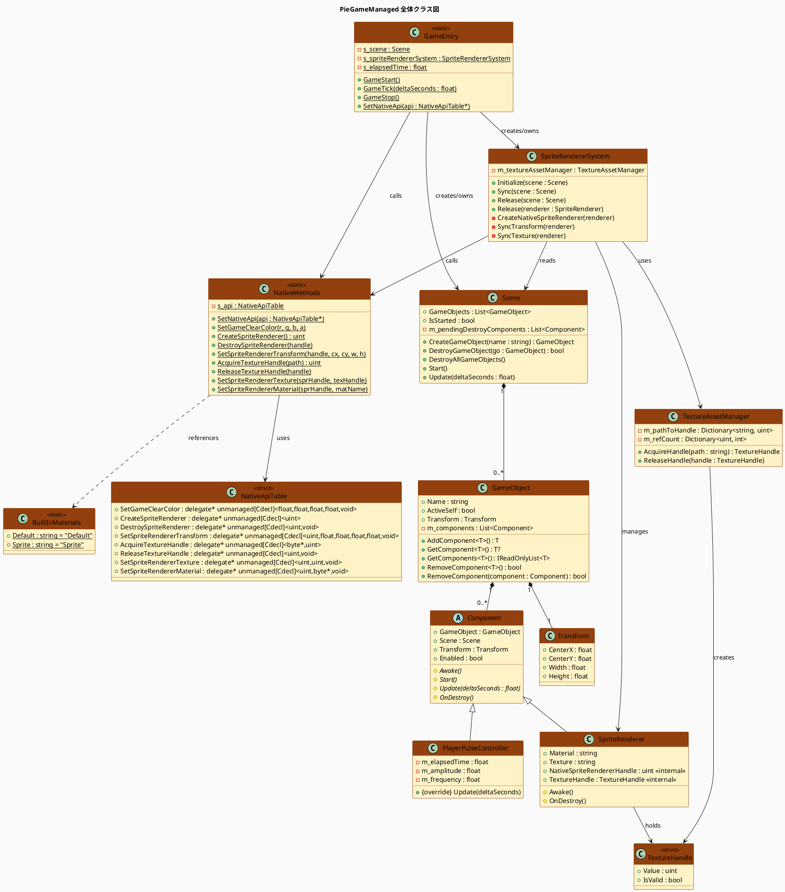
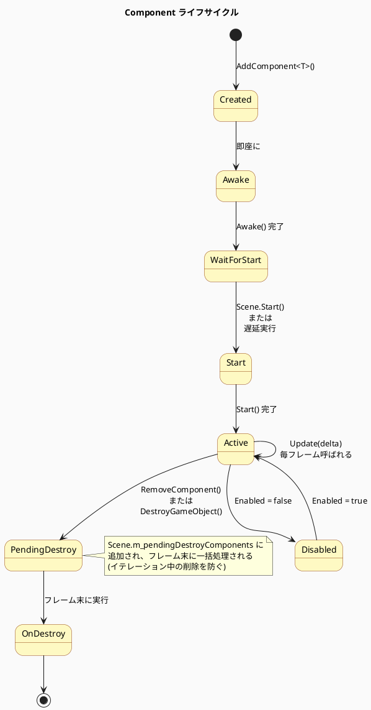
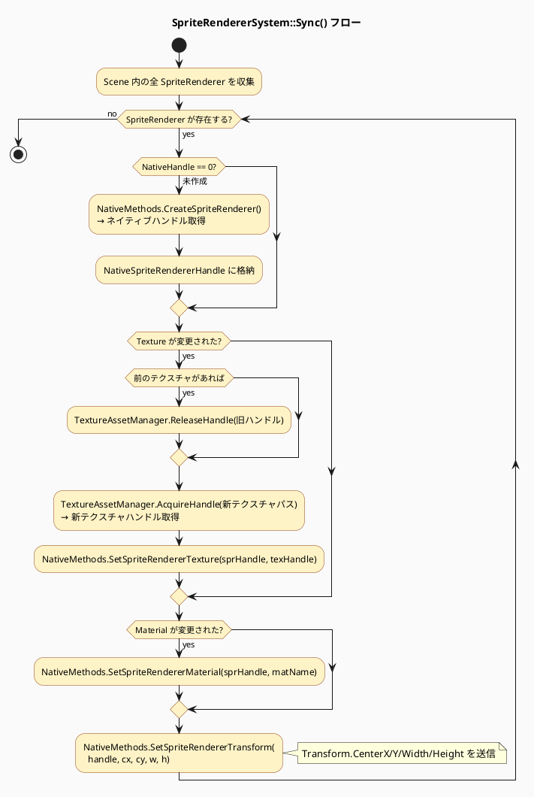
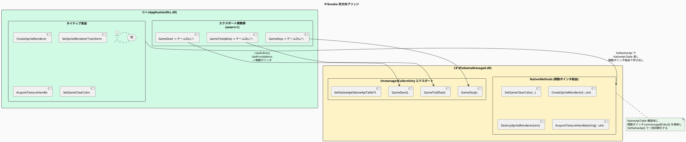

# クラス図 - PieGameManaged (C# マネージド側)

## 全体クラス図

```plantuml
@startuml
skinparam backgroundColor #FAFAFA
skinparam classBackgroundColor #FEF3C7
skinparam classBorderColor #92400E
skinparam classHeaderBackgroundColor #92400E
skinparam classHeaderFontColor white

title PieGameManaged 全体クラス図

class GameEntry <<static>> {
  + {static} GameStart()
  + {static} GameTick(deltaSeconds : float)
  + {static} GameStop()
  + {static} SetNativeApi(api : NativeApiTable*)
  - {static} s_scene : Scene
  - {static} s_spriteRendererSystem : SpriteRendererSystem
  - {static} s_elapsedTime : float
}

class Scene {
  + GameObjects : List<GameObject>
  + IsStarted : bool
  + CreateGameObject(name : string) : GameObject
  + DestroyGameObject(go : GameObject) : bool
  + DestroyAllGameObjects()
  + Start()
  + Update(deltaSeconds : float)
  - m_pendingDestroyComponents : List<Component>
}

class GameObject {
  + Name : string
  + ActiveSelf : bool
  + Transform : Transform
  + AddComponent<T>() : T
  + GetComponent<T>() : T?
  + GetComponents<T>() : IReadOnlyList<T>
  + RemoveComponent<T>() : bool
  + RemoveComponent(component : Component) : bool
  - m_components : List<Component>
}

abstract class Component {
  + GameObject : GameObject
  + Scene : Scene
  + Transform : Transform
  + Enabled : bool
  # {abstract} Awake()
  # {abstract} Start()
  # {abstract} Update(deltaSeconds : float)
  # {abstract} OnDestroy()
}

class Transform {
  + CenterX : float
  + CenterY : float
  + Width : float
  + Height : float
}

class SpriteRenderer {
  + Material : string
  + Texture : string
  + NativeSpriteRendererHandle : uint <<internal>>
  + TextureHandle : TextureHandle <<internal>>
  # Awake()
  # OnDestroy()
}

class SpriteRendererSystem {
  - m_textureAssetManager : TextureAssetManager
  + Initialize(scene : Scene)
  + Sync(scene : Scene)
  + Release(scene : Scene)
  + Release(renderer : SpriteRenderer)
  - CreateNativeSpriteRenderer(renderer)
  - SyncTransform(renderer)
  - SyncTexture(renderer)
}

class TextureAssetManager {
  - m_pathToHandle : Dictionary<string, uint>
  - m_refCount : Dictionary<uint, int>
  + AcquireHandle(path : string) : TextureHandle
  + ReleaseHandle(handle : TextureHandle)
}

class TextureHandle <<struct>> {
  + Value : uint
  + IsValid : bool
}

class PlayerPulseController {
  - m_elapsedTime : float
  - m_amplitude : float
  - m_frequency : float
  + {override} Update(deltaSeconds)
}

class NativeMethods <<static>> {
  - {static} s_api : NativeApiTable
  + {static} SetNativeApi(api : NativeApiTable*)
  + {static} SetGameClearColor(r, g, b, a)
  + {static} CreateSpriteRenderer() : uint
  + {static} DestroySpriteRenderer(handle)
  + {static} SetSpriteRendererTransform(handle, cx, cy, w, h)
  + {static} AcquireTextureHandle(path) : uint
  + {static} ReleaseTextureHandle(handle)
  + {static} SetSpriteRendererTexture(sprHandle, texHandle)
  + {static} SetSpriteRendererMaterial(sprHandle, matName)
}

class NativeApiTable <<struct>> {
  + SetGameClearColor : delegate* unmanaged[Cdecl]<float,float,float,float,void>
  + CreateSpriteRenderer : delegate* unmanaged[Cdecl]<uint>
  + DestroySpriteRenderer : delegate* unmanaged[Cdecl]<uint,void>
  + SetSpriteRendererTransform : delegate* unmanaged[Cdecl]<uint,float,float,float,float,void>
  + AcquireTextureHandle : delegate* unmanaged[Cdecl]<byte*,uint>
  + ReleaseTextureHandle : delegate* unmanaged[Cdecl]<uint,void>
  + SetSpriteRendererTexture : delegate* unmanaged[Cdecl]<uint,uint,void>
  + SetSpriteRendererMaterial : delegate* unmanaged[Cdecl]<uint,byte*,void>
}

class BuiltInMaterials <<static>> {
  + {static} Default : string = "Default"
  + {static} Sprite : string = "Sprite"
}

GameEntry --> Scene : creates/owns
GameEntry --> SpriteRendererSystem : creates/owns
GameEntry --> NativeMethods : calls

Scene "1" *-- "0..*" GameObject
GameObject "1" *-- "1" Transform
GameObject "1" *-- "0..*" Component

Component <|-- SpriteRenderer
Component <|-- PlayerPulseController

SpriteRendererSystem --> Scene : reads
SpriteRendererSystem --> SpriteRenderer : manages
SpriteRendererSystem --> TextureAssetManager : uses
SpriteRendererSystem --> NativeMethods : calls

TextureAssetManager --> TextureHandle : creates
SpriteRenderer --> TextureHandle : holds

NativeMethods --> NativeApiTable : uses
NativeMethods ..> BuiltInMaterials : references

@enduml
```

## コンポーネントライフサイクル

```plantuml
@startuml
skinparam backgroundColor #FAFAFA
skinparam stateBackgroundColor #FEF9C3
skinparam stateBorderColor #92400E

title Component ライフサイクル

[*] --> Created : AddComponent<T>()

Created --> Awake : 即座に
Awake --> WaitForStart : Awake() 完了

WaitForStart --> Start : Scene.Start()\nまたは\n遅延実行

Start --> Active : Start() 完了

Active --> Active : Update(delta)\n毎フレーム呼ばれる

Active --> Disabled : Enabled = false
Disabled --> Active : Enabled = true

Active --> PendingDestroy : RemoveComponent()\nまたは\nDestroyGameObject()

PendingDestroy --> OnDestroy : フレーム末に実行
OnDestroy --> [*]

note right of PendingDestroy
  Scene.m_pendingDestroyComponents に
  追加され、フレーム末に一括処理される
  (イテレーション中の削除を防ぐ)
end note

@enduml
```

## SpriteRenderer 同期フロー

```plantuml
@startuml
skinparam backgroundColor #FAFAFA
skinparam activityBackgroundColor #FEF3C7
skinparam activityBorderColor #92400E

title SpriteRendererSystem::Sync() フロー

start

:Scene 内の全 SpriteRenderer を収集;

while (SpriteRenderer が存在する?) is (yes)

  if (NativeHandle == 0?) then (未作成)
    :NativeMethods.CreateSpriteRenderer()\n→ ネイティブハンドル取得;
    :NativeSpriteRendererHandle に格納;
  endif

  if (Texture が変更された?) then (yes)
    if (前のテクスチャがあれば) then (yes)
      :TextureAssetManager.ReleaseHandle(旧ハンドル);
    endif
    :TextureAssetManager.AcquireHandle(新テクスチャパス)\n→ 新テクスチャハンドル取得;
    :NativeMethods.SetSpriteRendererTexture(sprHandle, texHandle);
  endif

  if (Material が変更された?) then (yes)
    :NativeMethods.SetSpriteRendererMaterial(sprHandle, matName);
  endif

  :NativeMethods.SetSpriteRendererTransform(\n  handle, cx, cy, w, h);
  note right: Transform.CenterX/Y/Width/Height を送信

endwhile (no)

stop

@enduml
```

## NativeApiTable - P/Invoke ブリッジ設計

```plantuml
@startuml
skinparam backgroundColor #FAFAFA
skinparam noteBackgroundColor #E8F5E9

title P/Invoke 双方向ブリッジ

rectangle "C++ (ApplicationDLL.dll)" #D1FAE5 {
  rectangle "エクスポート関数群\n(extern C)" as CppExports {
    [GameStart → ゲームDLLへ]
    [GameTick(delta) → ゲームDLLへ]
    [GameStop → ゲームDLLへ]
  }

  rectangle "ネイティブ実装" as NativeImpl {
    [CreateSpriteRenderer]
    [SetSpriteRendererTransform]
    [AcquireTextureHandle]
    [SetGameClearColor]
    ...(他)
  }
}

rectangle "C# (PieGameManaged.dll)" #FEF3C7 {
  rectangle "UnmanagedCallersOnly エクスポート" as CsExports {
    [GameStart()]
    [GameTick(float)]
    [GameStop()]
    [SetNativeApi(NativeApiTable*)]
  }

  rectangle "NativeMethods (関数ポインタ経由)" as CsWrapper {
    [SetGameClearColor(...)]
    [CreateSpriteRenderer() : uint]
    [DestroySpriteRenderer(uint)]
    [AcquireTextureHandle(string) : uint]
    ...(他)
  }
}

[GameStart → ゲームDLLへ] --> [GameStart()] : LoadLibrary\nGetProcAddress\n→ 関数ポインタ
[GameTick(delta) → ゲームDLLへ] --> [GameTick(float)]
[GameStop → ゲームDLLへ] --> [GameStop()]

NativeImpl --> CsWrapper : SetNativeApi で\nNativeApiTable 渡し\n関数ポインタ経由で呼び出し

note bottom of CsWrapper
  NativeApiTable 構造体に
  関数ポインタ (unmanaged[Cdecl]) を格納し
  SetNativeApi() で一括初期化する
end note

@enduml
```
