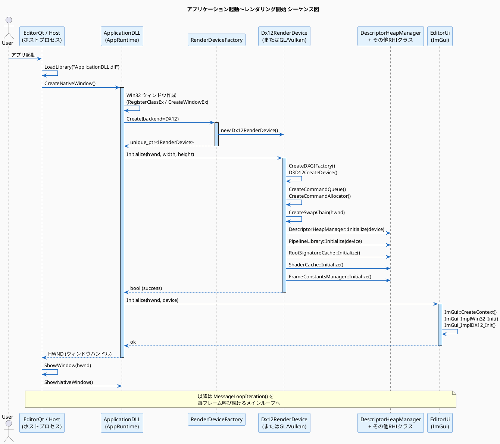
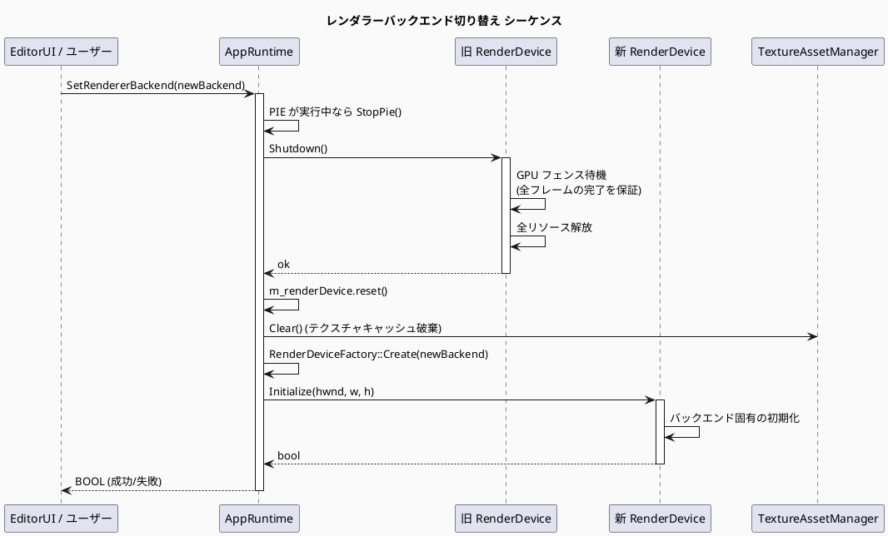
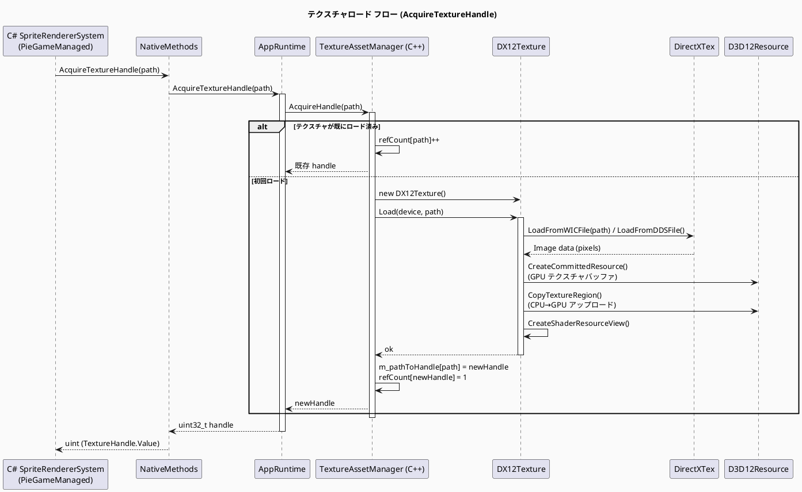

# シーケンス図 - 初期化フロー

## アプリケーション起動〜レンダリング開始

```plantuml
@startuml
skinparam backgroundColor #FAFAFA
skinparam sequenceArrowColor #1565C0
skinparam sequenceParticipantBackgroundColor #E3F2FD
skinparam sequenceParticipantBorderColor #1565C0
skinparam sequenceLifeLineBackgroundColor #BBDEFB

title アプリケーション起動〜レンダリング開始 シーケンス図

actor User
participant "EditorQt / Host\n(ホストプロセス)" as Host
participant "ApplicationDLL\n(AppRuntime)" as AppRuntime
participant "RenderDeviceFactory" as Factory
participant "Dx12RenderDevice\n(またはGL/Vulkan)" as RD
participant "DescriptorHeapManager\n+ その他RHIクラス" as RHI
participant "EditorUi\n(ImGui)" as EditorUi

User -> Host : アプリ起動

Host -> Host : LoadLibrary("ApplicationDLL.dll")

Host -> AppRuntime : CreateNativeWindow()
activate AppRuntime

  AppRuntime -> AppRuntime : Win32 ウィンドウ作成\n(RegisterClassEx / CreateWindowEx)

  AppRuntime -> Factory : Create(backend=DX12)
  activate Factory
    Factory -> RD : new Dx12RenderDevice()
    Factory --> AppRuntime : unique_ptr<IRenderDevice>
  deactivate Factory

  AppRuntime -> RD : Initialize(hwnd, width, height)
  activate RD
    RD -> RD : CreateDXGIFactory()\nD3D12CreateDevice()
    RD -> RD : CreateCommandQueue()\nCreateCommandAllocator()
    RD -> RD : CreateSwapChain(hwnd)
    RD -> RHI : DescriptorHeapManager::Initialize(device)
    RD -> RHI : PipelineLibrary::Initialize(device)
    RD -> RHI : RootSignatureCache::Initialize()
    RD -> RHI : ShaderCache::Initialize()
    RD -> RHI : FrameConstantsManager::Initialize()
    RD --> AppRuntime : bool (success)
  deactivate RD

  AppRuntime -> EditorUi : Initialize(hwnd, device)
  activate EditorUi
    EditorUi -> EditorUi : ImGui::CreateContext()\nImGui_ImplWin32_Init()\nImGui_ImplDX12_Init()
    EditorUi --> AppRuntime : ok
  deactivate EditorUi

  AppRuntime --> Host : HWND (ウィンドウハンドル)
deactivate AppRuntime

Host -> Host : ShowWindow(hwnd)
Host -> AppRuntime : ShowNativeWindow()

note over Host, EditorUi
  以降は MessageLoopIteration() を
  毎フレーム呼び続けるメインループへ
end note

@enduml
```

## レンダリングデバイス切り替え時の再初期化

```plantuml
@startuml
skinparam backgroundColor #FAFAFA

title レンダラーバックエンド切り替え シーケンス

participant "EditorUI / ユーザー" as UI
participant "AppRuntime" as AR
participant "旧 RenderDevice" as OldRD
participant "新 RenderDevice" as NewRD
participant "TextureAssetManager" as TAM

UI -> AR : SetRendererBackend(newBackend)
activate AR

  AR -> AR : PIE が実行中なら StopPie()

  AR -> OldRD : Shutdown()
  activate OldRD
    OldRD -> OldRD : GPU フェンス待機\n(全フレームの完了を保証)
    OldRD -> OldRD : 全リソース解放
    OldRD --> AR : ok
  deactivate OldRD

  AR -> AR : m_renderDevice.reset()

  AR -> TAM : Clear() (テクスチャキャッシュ破棄)

  AR -> AR : RenderDeviceFactory::Create(newBackend)
  AR -> NewRD : Initialize(hwnd, w, h)
  activate NewRD
    NewRD -> NewRD : バックエンド固有の初期化
    NewRD --> AR : bool
  deactivate NewRD

  AR --> UI : BOOL (成功/失敗)
deactivate AR

@enduml
```

## テクスチャロード フロー

```plantuml
@startuml
skinparam backgroundColor #FAFAFA

title テクスチャロード フロー (AcquireTextureHandle)

participant "C# SpriteRendererSystem\n(PieGameManaged)" as CS
participant "NativeMethods" as NM
participant "AppRuntime" as AR
participant "TextureAssetManager (C++)" as TAM
participant "DX12Texture" as Tex
participant "DirectXTex" as DxTex
participant "D3D12Resource" as D3D

CS -> NM : AcquireTextureHandle(path)
NM -> AR : AcquireTextureHandle(path)
activate AR

  AR -> TAM : AcquireHandle(path)
  activate TAM

    alt テクスチャが既にロード済み
      TAM -> TAM : refCount[path]++
      TAM --> AR : 既存 handle
    else 初回ロード
      TAM -> Tex : new DX12Texture()
      TAM -> Tex : Load(device, path)
      activate Tex
        Tex -> DxTex : LoadFromWICFile(path) / LoadFromDDSFile()
        DxTex --> Tex : Image data (pixels)
        Tex -> D3D : CreateCommittedResource()\n(GPU テクスチャバッファ)
        Tex -> D3D : CopyTextureRegion()\n(CPU→GPU アップロード)
        Tex -> Tex : CreateShaderResourceView()
        Tex --> TAM : ok
      deactivate Tex
      TAM -> TAM : m_pathToHandle[path] = newHandle\nrefCount[newHandle] = 1
      TAM --> AR : newHandle
    end

  deactivate TAM

  AR --> NM : uint32_t handle
deactivate AR

NM --> CS : uint (TextureHandle.Value)

@enduml
```
