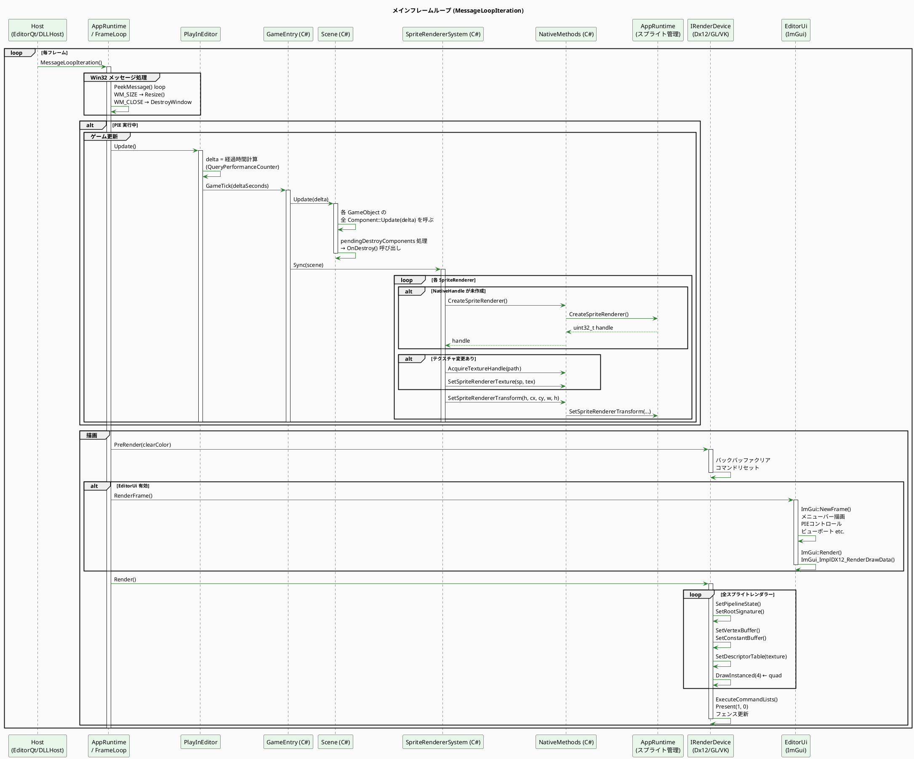
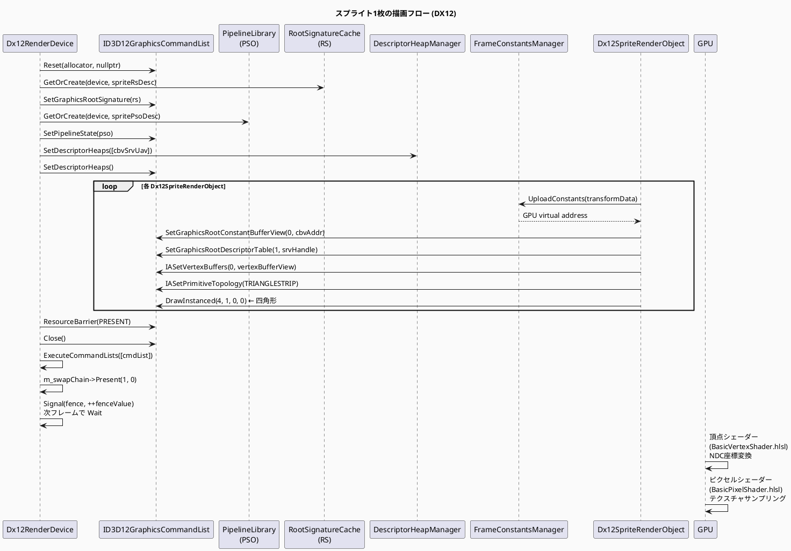
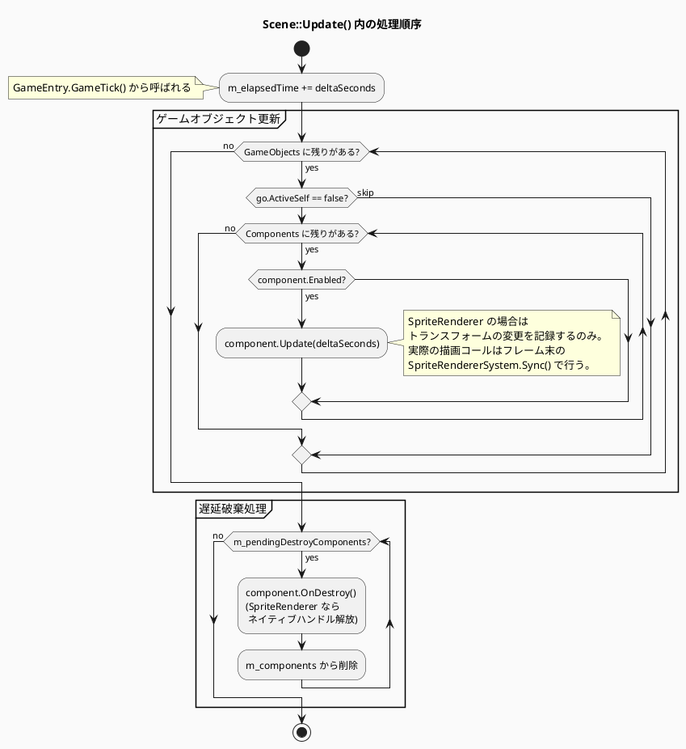

# シーケンス図 - フレームループ

## メインフレームループ全体

```plantuml
@startuml
skinparam backgroundColor #FAFAFA
skinparam sequenceArrowColor #2E7D32
skinparam sequenceParticipantBackgroundColor #E8F5E9

title メインフレームループ (MessageLoopIteration)

participant "Host\n(EditorQt/DLLHost)" as Host
participant "AppRuntime\n/ FrameLoop" as FL
participant "PlayInEditor" as PIE
participant "GameEntry (C#)" as GE
participant "Scene (C#)" as Scene
participant "SpriteRendererSystem (C#)" as SRS
participant "NativeMethods (C#)" as NM
participant "AppRuntime\n(スプライト管理)" as AR
participant "IRenderDevice\n(Dx12/GL/VK)" as RD
participant "EditorUi\n(ImGui)" as UI

loop 毎フレーム
  Host -> FL : MessageLoopIteration()
  activate FL

  group Win32 メッセージ処理
    FL -> FL : PeekMessage() loop\nWM_SIZE → Resize()\nWM_CLOSE → DestroyWindow
  end

  alt PIE 実行中
    group ゲーム更新
      FL -> PIE : Update()
      activate PIE
        PIE -> PIE : delta = 経過時間計算\n(QueryPerformanceCounter)
        PIE -> GE : GameTick(deltaSeconds)
        activate GE
          GE -> Scene : Update(delta)
          activate Scene
            Scene -> Scene : 各 GameObject の\n全 Component::Update(delta) を呼ぶ
            Scene -> Scene : pendingDestroyComponents 処理\n→ OnDestroy() 呼び出し
          deactivate Scene

          GE -> SRS : Sync(scene)
          activate SRS
            loop 各 SpriteRenderer
              alt NativeHandle が未作成
                SRS -> NM : CreateSpriteRenderer()
                NM -> AR : CreateSpriteRenderer()
                AR --> NM : uint32_t handle
                NM --> SRS : handle
              end
              alt テクスチャ変更あり
                SRS -> NM : AcquireTextureHandle(path)
                SRS -> NM : SetSpriteRendererTexture(sp, tex)
              end
              SRS -> NM : SetSpriteRendererTransform(h, cx, cy, w, h)
              NM -> AR : SetSpriteRendererTransform(...)
            end
          deactivate SRS
        deactivate GE
      deactivate PIE
    end
  end

  group 描画
    FL -> RD : PreRender(clearColor)
    activate RD
      RD -> RD : バックバッファクリア\nコマンドリセット
    deactivate RD

    alt EditorUi 有効
      FL -> UI : RenderFrame()
      activate UI
        UI -> UI : ImGui::NewFrame()\nメニューバー描画\nPIEコントロール\nビューポート etc.
        UI -> UI : ImGui::Render()\nImGui_ImplDX12_RenderDrawData()
      deactivate UI
    end

    FL -> RD : Render()
    activate RD
      loop 全スプライトレンダラー
        RD -> RD : SetPipelineState()\nSetRootSignature()
        RD -> RD : SetVertexBuffer()\nSetConstantBuffer()
        RD -> RD : SetDescriptorTable(texture)
        RD -> RD : DrawInstanced(4) ← quad
      end
      RD -> RD : ExecuteCommandLists()\nPresent(1, 0)\nフェンス更新
    deactivate RD
  end

  deactivate FL
end

@enduml
```

## スプライト描画詳細 (DirectX12)

```plantuml
@startuml
skinparam backgroundColor #FAFAFA

title スプライト1枚の描画フロー (DX12)

participant "Dx12RenderDevice" as RD
participant "ID3D12GraphicsCommandList" as CL
participant "PipelineLibrary\n(PSO)" as PSO
participant "RootSignatureCache\n(RS)" as RS
participant "DescriptorHeapManager" as DHM
participant "FrameConstantsManager" as FCM
participant "Dx12SpriteRenderObject" as SRO
participant "GPU" as GPU

RD -> CL : Reset(allocator, nullptr)
RD -> RS : GetOrCreate(device, spriteRsDesc)
RD -> CL : SetGraphicsRootSignature(rs)
RD -> PSO : GetOrCreate(device, spritePsoDesc)
RD -> CL : SetPipelineState(pso)
RD -> DHM : SetDescriptorHeaps([cbvSrvUav])
RD -> CL : SetDescriptorHeaps()

loop 各 Dx12SpriteRenderObject
  SRO -> FCM : UploadConstants(transformData)
  FCM --> SRO : GPU virtual address
  SRO -> CL : SetGraphicsRootConstantBufferView(0, cbvAddr)
  SRO -> CL : SetGraphicsRootDescriptorTable(1, srvHandle)
  SRO -> CL : IASetVertexBuffers(0, vertexBufferView)
  SRO -> CL : IASetPrimitiveTopology(TRIANGLESTRIP)
  SRO -> CL : DrawInstanced(4, 1, 0, 0) ← 四角形
end

RD -> CL : ResourceBarrier(PRESENT)
RD -> CL : Close()
RD -> RD : ExecuteCommandLists([cmdList])
RD -> RD : m_swapChain->Present(1, 0)
RD -> RD : Signal(fence, ++fenceValue)\n次フレームで Wait

GPU -> GPU : 頂点シェーダー\n(BasicVertexShader.hlsl)\nNDC座標変換

GPU -> GPU : ピクセルシェーダー\n(BasicPixelShader.hlsl)\nテクスチャサンプリング

@enduml
```

## Component::Update 呼び出し順序

```plantuml
@startuml
skinparam backgroundColor #FAFAFA

title Scene::Update() 内の処理順序

start

:m_elapsedTime += deltaSeconds;

note: GameEntry.GameTick() から呼ばれる

partition "ゲームオブジェクト更新" {
  while (GameObjects に残りがある?) is (yes)
    if (go.ActiveSelf == false?) then (skip)
    else
      while (Components に残りがある?) is (yes)
        if (component.Enabled?) then (yes)
          :component.Update(deltaSeconds);
          note right
            SpriteRenderer の場合は
            トランスフォームの変更を記録するのみ。
            実際の描画コールはフレーム末の
            SpriteRendererSystem.Sync() で行う。
          end note
        endif
      endwhile (no)
    endif
  endwhile (no)
}

partition "遅延破棄処理" {
  while (m_pendingDestroyComponents?) is (yes)
    :component.OnDestroy()\n(SpriteRenderer なら\n ネイティブハンドル解放);
    :m_components から削除;
  endwhile (no)
}

stop

@enduml
```
