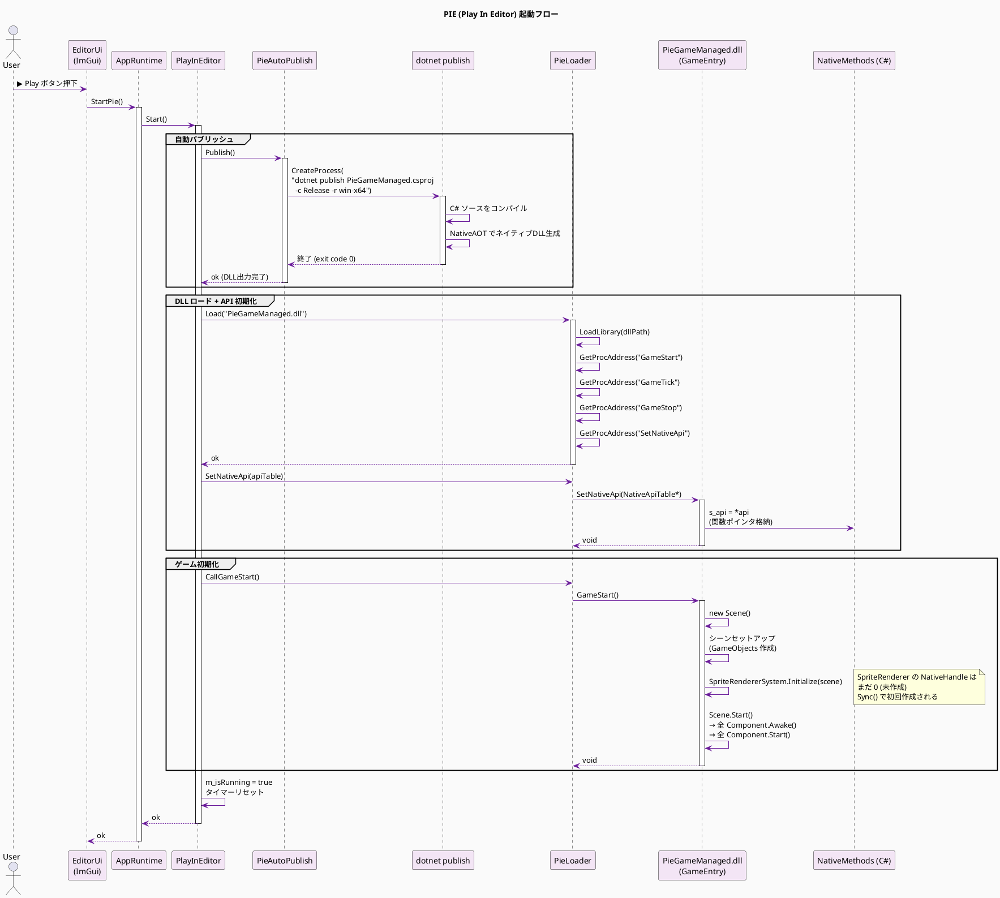
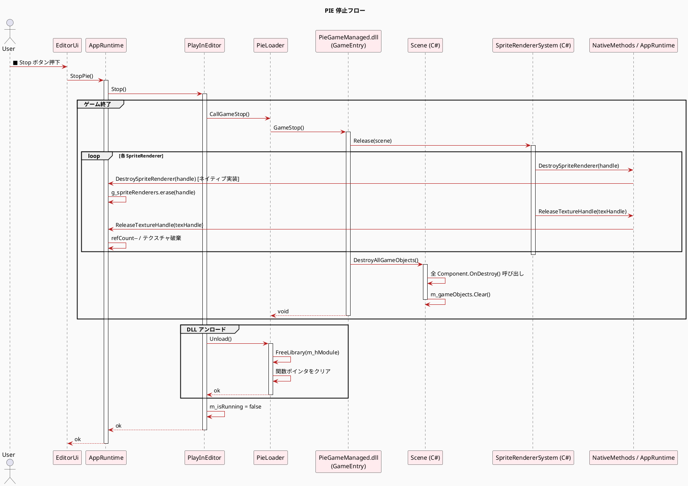
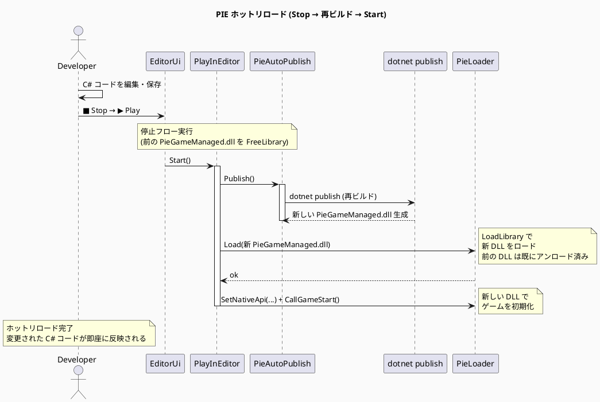
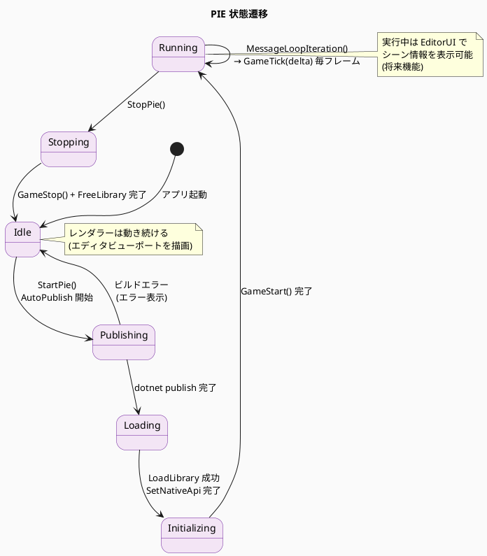

# シーケンス図 - PIE (Play In Editor)

## PIE 起動フロー

```plantuml
@startuml
skinparam backgroundColor #FAFAFA
skinparam sequenceArrowColor #6A1B9A
skinparam sequenceParticipantBackgroundColor #F3E5F5

title PIE (Play In Editor) 起動フロー

actor User
participant "EditorUi\n(ImGui)" as UI
participant "AppRuntime" as AR
participant "PlayInEditor" as PIE
participant "PieAutoPublish" as Pub
participant "dotnet publish" as DotNet
participant "PieLoader" as Loader
participant "PieGameManaged.dll\n(GameEntry)" as Game
participant "NativeMethods (C#)" as NM

User -> UI : ▶ Play ボタン押下
UI -> AR : StartPie()
activate AR
  AR -> PIE : Start()
  activate PIE

  group 自動パブリッシュ
    PIE -> Pub : Publish()
    activate Pub
      Pub -> DotNet : CreateProcess(\n"dotnet publish PieGameManaged.csproj\n  -c Release -r win-x64")
      activate DotNet
        DotNet -> DotNet : C# ソースをコンパイル
        DotNet -> DotNet : NativeAOT でネイティブDLL生成
        DotNet --> Pub : 終了 (exit code 0)
      deactivate DotNet
      Pub --> PIE : ok (DLL出力完了)
    deactivate Pub
  end

  group DLL ロード + API 初期化
    PIE -> Loader : Load("PieGameManaged.dll")
    activate Loader
      Loader -> Loader : LoadLibrary(dllPath)
      Loader -> Loader : GetProcAddress("GameStart")
      Loader -> Loader : GetProcAddress("GameTick")
      Loader -> Loader : GetProcAddress("GameStop")
      Loader -> Loader : GetProcAddress("SetNativeApi")
      Loader --> PIE : ok
    deactivate Loader

    PIE -> Loader : SetNativeApi(apiTable)
    Loader -> Game : SetNativeApi(NativeApiTable*)
    activate Game
      Game -> NM : s_api = *api\n(関数ポインタ格納)
      Game --> Loader : void
    deactivate Game
  end

  group ゲーム初期化
    PIE -> Loader : CallGameStart()
    Loader -> Game : GameStart()
    activate Game
      Game -> Game : new Scene()
      Game -> Game : シーンセットアップ\n(GameObjects 作成)
      Game -> Game : SpriteRendererSystem.Initialize(scene)
      note right
        SpriteRenderer の NativeHandle は
        まだ 0 (未作成)
        Sync() で初回作成される
      end note
      Game -> Game : Scene.Start()\n→ 全 Component.Awake()\n→ 全 Component.Start()
      Game --> Loader : void
    deactivate Game
  end

  PIE -> PIE : m_isRunning = true\nタイマーリセット
  PIE --> AR : ok
  deactivate PIE

AR --> UI : ok
deactivate AR

@enduml
```

## PIE 停止フロー

```plantuml
@startuml
skinparam backgroundColor #FAFAFA
skinparam sequenceArrowColor #B71C1C
skinparam sequenceParticipantBackgroundColor #FFEBEE

title PIE 停止フロー

actor User
participant "EditorUi" as UI
participant "AppRuntime" as AR
participant "PlayInEditor" as PIE
participant "PieLoader" as Loader
participant "PieGameManaged.dll\n(GameEntry)" as Game
participant "Scene (C#)" as Scene
participant "SpriteRendererSystem (C#)" as SRS
participant "NativeMethods / AppRuntime" as NM

User -> UI : ■ Stop ボタン押下
UI -> AR : StopPie()
activate AR
  AR -> PIE : Stop()
  activate PIE

  group ゲーム終了
    PIE -> Loader : CallGameStop()
    Loader -> Game : GameStop()
    activate Game

      Game -> SRS : Release(scene)
      activate SRS
        loop 各 SpriteRenderer
          SRS -> NM : DestroySpriteRenderer(handle)
          NM -> AR : DestroySpriteRenderer(handle) [ネイティブ実装]
          AR -> AR : g_spriteRenderers.erase(handle)
          SRS -> NM : ReleaseTextureHandle(texHandle)
          NM -> AR : ReleaseTextureHandle(texHandle)
          AR -> AR : refCount-- / テクスチャ破棄
        end
      deactivate SRS

      Game -> Scene : DestroyAllGameObjects()
      activate Scene
        Scene -> Scene : 全 Component.OnDestroy() 呼び出し
        Scene -> Scene : m_gameObjects.Clear()
      deactivate Scene

      Game --> Loader : void
    deactivate Game
  end

  group DLL アンロード
    PIE -> Loader : Unload()
    activate Loader
      Loader -> Loader : FreeLibrary(m_hModule)
      Loader -> Loader : 関数ポインタをクリア
      Loader --> PIE : ok
    deactivate Loader
  end

  PIE -> PIE : m_isRunning = false
  PIE --> AR : ok
  deactivate PIE

AR --> UI : ok
deactivate AR

@enduml
```

## PIE ホットリロード フロー

```plantuml
@startuml
skinparam backgroundColor #FAFAFA

title PIE ホットリロード (Stop → 再ビルド → Start)

actor Developer
participant "EditorUi" as UI
participant "PlayInEditor" as PIE
participant "PieAutoPublish" as Pub
participant "dotnet publish" as DN
participant "PieLoader" as Loader

Developer -> Developer : C# コードを編集・保存

Developer -> UI : ■ Stop → ▶ Play

note over PIE: 停止フロー実行\n(前の PieGameManaged.dll を FreeLibrary)

UI -> PIE : Start()
activate PIE

PIE -> Pub : Publish()
activate Pub
  Pub -> DN : dotnet publish (再ビルド)
  DN --> Pub : 新しい PieGameManaged.dll 生成
deactivate Pub

PIE -> Loader : Load(新 PieGameManaged.dll)
note right: LoadLibrary で\n新 DLL をロード\n前の DLL は既にアンロード済み

Loader --> PIE : ok

PIE -> Loader : SetNativeApi(...) + CallGameStart()
note right: 新しい DLL で\nゲームを初期化

deactivate PIE

note over Developer
  ホットリロード完了
  変更された C# コードが即座に反映される
end note

@enduml
```

## PIE 状態遷移図

```plantuml
@startuml
skinparam backgroundColor #FAFAFA
skinparam stateBackgroundColor #F3E5F5
skinparam stateBorderColor #6A1B9A

title PIE 状態遷移

[*] --> Idle : アプリ起動

Idle --> Publishing : StartPie()\nAutoPublish 開始

Publishing --> Loading : dotnet publish 完了
Publishing --> Idle : ビルドエラー\n(エラー表示)

Loading --> Initializing : LoadLibrary 成功\nSetNativeApi 完了

Initializing --> Running : GameStart() 完了

Running --> Running : MessageLoopIteration()\n→ GameTick(delta) 毎フレーム

Running --> Stopping : StopPie()

Stopping --> Idle : GameStop() + FreeLibrary 完了

note right of Running
  実行中は EditorUI で
  シーン情報を表示可能
  (将来機能)
end note

note right of Idle
  レンダラーは動き続ける
  (エディタビューポートを描画)
end note

@enduml
```
