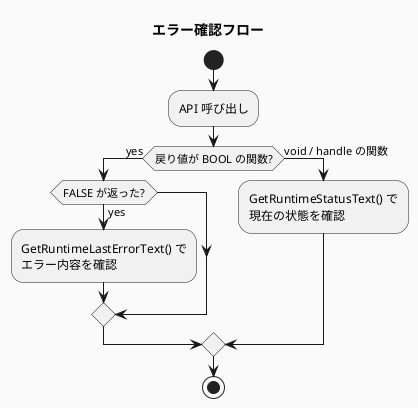

# API仕様

## ApplicationDLL 公開 C API

`dllmain.cpp` で `extern "C" __declspec(dllexport)` として公開されるAPI。  
EditorQt および ApplicationDLLHost が LoadLibrary / GetProcAddress またはヘッダ直接参照で使用する。

### ウィンドウ管理

| 関数 | 戻り値 | 説明 |
|------|--------|------|
| `CreateNativeWindow()` | `HWND` | スタンドアロンウィンドウを作成し表示 |
| `CreateNativeChildWindow(parent, w, h)` | `HWND` | 親ウィンドウへ埋め込む子ウィンドウを作成 |
| `CreateGameNativeWindow()` | `HWND` | ゲームビュー専用ウィンドウを作成 |
| `CreateGameNativeChildWindow(parent, w, h)` | `HWND` | ゲームビュー専用子ウィンドウを作成 |
| `ShowNativeWindow()` | `void` | エディタウィンドウを表示 |
| `HideNativeWindow()` | `void` | エディタウィンドウを非表示 |
| `DestroyNativeWindow()` | `void` | エディタウィンドウを破棄 |
| `DestroyGameNativeWindow()` | `void` | ゲームウィンドウを破棄 |
| `GetNativeWindowHandle()` | `HWND` | エディタウィンドウハンドルを取得 |
| `GetGameNativeWindowHandle()` | `HWND` | ゲームウィンドウハンドルを取得 |

### フレーム制御

| 関数 | 戻り値 | 説明 |
|------|--------|------|
| `MessageLoopIteration()` | `void` | 1フレーム分の処理（Win32メッセージ・更新・描画）を実行 |

> **注:** ホストプロセスが独自のメッセージループを持つ場合でも、本関数を毎フレーム呼ぶ必要がある。

### PIE 制御

| 関数 | 戻り値 | 説明 |
|------|--------|------|
| `StartPie()` | `void` | PieGameManaged をビルド→ロード→GameStart() |
| `StopPie()` | `void` | GameStop() → DLL アンロード |
| `SetEditorUiEnabled(enabled)` | `void` | ImGui エディタUI の表示切り替え |
| `IsEditorUiEnabled()` | `BOOL` | ImGui エディタUI が有効か |
| `GetRuntimeStatusText()` | `const char*` | 現在の状態テキスト（UTF-8） |
| `GetRuntimeLastErrorText()` | `const char*` | 最後のエラーテキスト（UTF-8） |

### 描画制御

| 関数 | 戻り値 | 説明 |
|------|--------|------|
| `SetGameClearColor(r, g, b, a)` | `void` | ゲームビューのクリアカラーを設定（0.0〜1.0） |
| `CreateSpriteRenderer()` | `uint32_t` | スプライトレンダラーを生成しハンドルを返す |
| `DestroySpriteRenderer(handle)` | `void` | スプライトレンダラーを破棄 |
| `SetSpriteRendererTransform(handle, cx, cy, w, h)` | `void` | 位置・サイズを設定（NDC座標: -1.0〜1.0） |
| `SetSpriteRendererMaterial(handle, materialName)` | `void` | マテリアルを設定（例: "Default", "Sprite"） |

### テクスチャ管理

| 関数 | 戻り値 | 説明 |
|------|--------|------|
| `AcquireTextureHandle(path)` | `uint32_t` | テクスチャをロードし参照カウントを増やしてハンドルを返す |
| `ReleaseTextureHandle(handle)` | `void` | 参照カウントを減らし、0になればGPUリソースを解放 |
| `SetSpriteRendererTexture(sprHandle, texHandle)` | `void` | スプライトにテクスチャを設定 |

> `AcquireTextureHandle` は同一パスに対して同じハンドルを返す（参照カウント方式）。  
> テクスチャを解放するには必ず `ReleaseTextureHandle` を呼ぶこと。

### ビューポート管理

| 関数 | 戻り値 | 説明 |
|------|--------|------|
| `SetSceneViewportCamera(cx, cy, zoom)` | `void` | シーンビューポートのカメラ位置・ズームを設定 |
| `GetSceneViewportCamera(cx*, cy*, zoom*)` | `void` | シーンビューポートのカメラ情報を取得 |
| `SetSceneViewportRotation(degrees)` | `void` | シーンビューポートの回転を設定 |
| `GetSceneViewportRotation()` | `float` | シーンビューポートの回転を取得 |
| `SetGameViewportCamera(cx, cy, zoom)` | `void` | ゲームビューポートのカメラを設定 |
| `GetGameViewportCamera(cx*, cy*, zoom*)` | `void` | ゲームビューポートのカメラを取得 |

### レンダラー管理

| 関数 | 戻り値 | 説明 |
|------|--------|------|
| `SetRendererBackend(backend)` | `BOOL` | バックエンドを切り替え（0=DX12, 1=Vulkan, 2=OpenGL） |
| `GetRendererBackend()` | `uint32_t` | 現在のバックエンドを取得 |

---

## PieGameManaged エクスポート API

C# `[UnmanagedCallersOnly]` 属性で公開されるエントリーポイント。  
ApplicationDLL の `PieLoader` が `GetProcAddress` で取得して呼び出す。

| エクスポート名 | シグネチャ | 説明 |
|-------------|---------|------|
| `GameStart` | `void()` | ゲーム初期化 (Scene作成・Start呼び出し) |
| `GameTick` | `void(float deltaSeconds)` | フレーム更新 (Scene::Update + SpriteRendererSystem::Sync) |
| `GameStop` | `void()` | リソース解放 (スプライト破棄・Scene破棄) |
| `SetNativeApi` | `void(NativeApiTable*)` | 関数ポインタテーブルを受け取りNativeMethods初期化 |

### NativeApiTable 構造体

C++ 側から渡される関数ポインタテーブル。  
`SetNativeApi(NativeApiTable*)` で初期化後、C# 内部で保持する。

```csharp
[StructLayout(LayoutKind.Sequential)]
internal unsafe struct NativeApiTable
{
    public delegate* unmanaged[Cdecl]<float, float, float, float, void>  SetGameClearColor;
    public delegate* unmanaged[Cdecl]<uint>                              CreateSpriteRenderer;
    public delegate* unmanaged[Cdecl]<uint, void>                        DestroySpriteRenderer;
    public delegate* unmanaged[Cdecl]<uint, float, float, float, float, void> SetSpriteRendererTransform;
    public delegate* unmanaged[Cdecl]<byte*, uint>                       AcquireTextureHandle;
    public delegate* unmanaged[Cdecl]<uint, void>                        ReleaseTextureHandle;
    public delegate* unmanaged[Cdecl]<uint, uint, void>                  SetSpriteRendererTexture;
    public delegate* unmanaged[Cdecl]<uint, byte*, void>                 SetSpriteRendererMaterial;
}
```

---

## ビルトインマテリアル

`BuiltInMaterials.cs` で定義される文字列定数。`SetSpriteRendererMaterial` に渡す。

| 定数名 | 値 | 説明 |
|--------|------|------|
| `BuiltInMaterials.Default` | `"Default"` | デフォルトマテリアル（テクスチャなし単色） |
| `BuiltInMaterials.Sprite` | `"Sprite"` | テクスチャ付きスプライト描画用 |

---

## NDC 座標系

スプライトの座標・サイズはすべて NDC (Normalized Device Coordinates) で指定する。

```
(-1, 1) ─────────── (1, 1)
    │                  │
    │   画面中央 (0,0) │
    │                  │
(-1,-1) ─────────── (1,-1)
```

| パラメータ | 意味 | 範囲 |
|-----------|------|------|
| `cx` | スプライト中心X | -1.0 〜 1.0 |
| `cy` | スプライト中心Y | -1.0 〜 1.0 |
| `w` | スプライト幅 | 0.0 〜 2.0 |
| `h` | スプライト高さ | 0.0 〜 2.0 |

---

## エラーハンドリング

`GetRuntimeLastErrorText()` で最後のエラーメッセージを UTF-8 文字列として取得できる。



---

## バージョン互換性

現時点では API バージョン管理は行っていない。  
ApplicationDLL と PieGameManaged は同一ソリューション内でビルドし、バイナリの整合性を保つこと。
